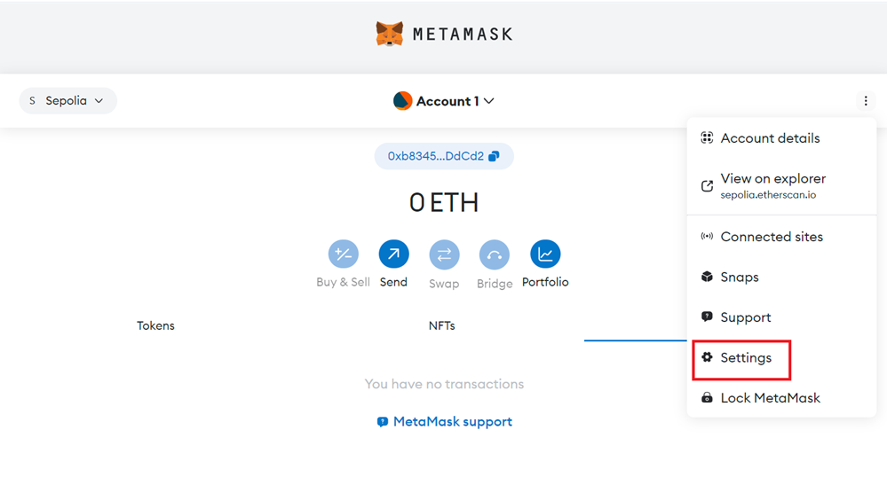
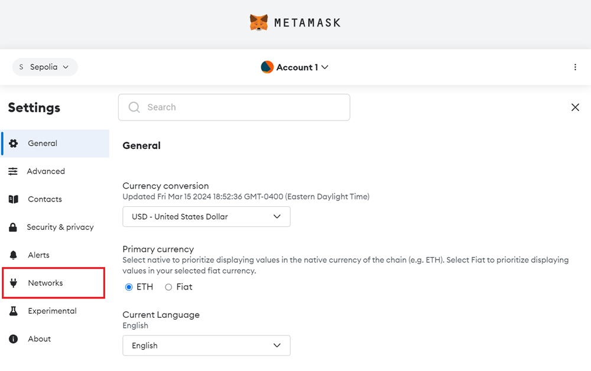
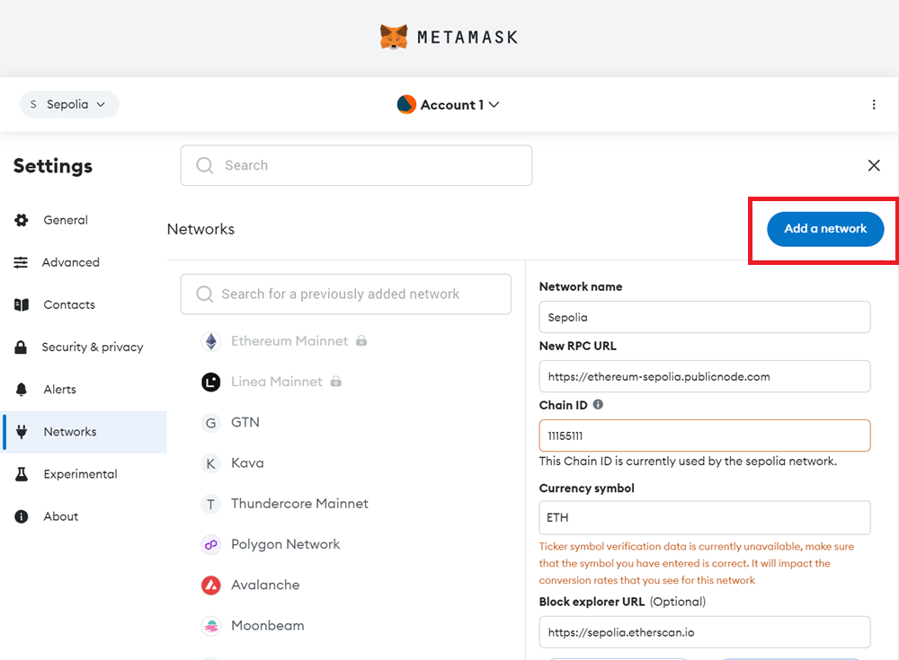
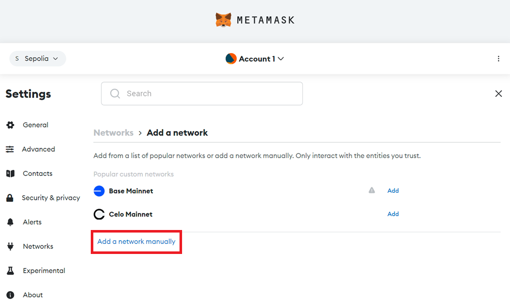
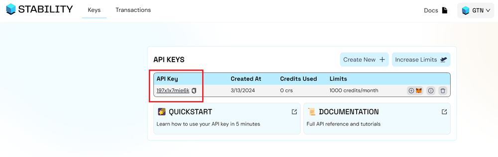
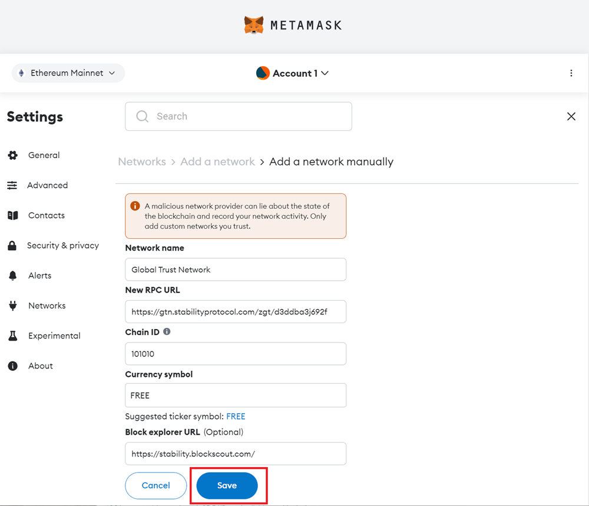
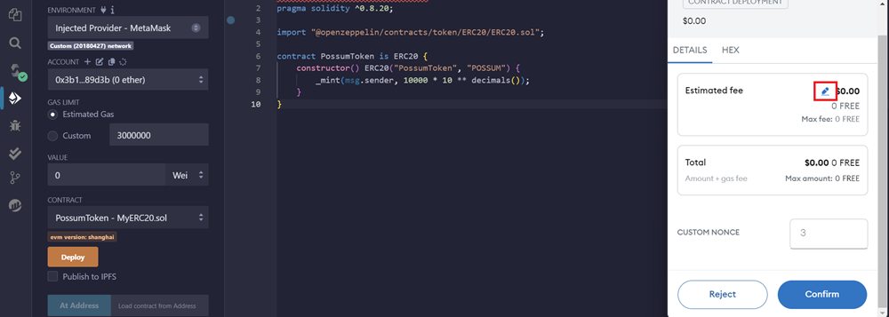
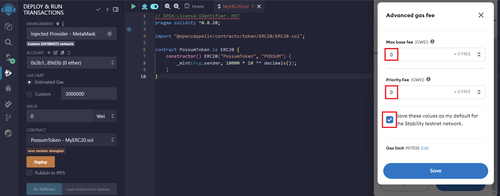

# Getting Started

This quickstart is tailored for developers eager to connect with and explore the capabilities of the Stability Testnet and Global Trust Network (GTN) directly. This guide is designed for developers aiming to craft decentralized applications (dApps), enthusiasts keen on engaging with Stability's blockchain, and anyone interested in understanding what sets Stability apart from traditional EVMs and smart contracts.

## Prerequisites

This tutorial presumes a foundational understanding of blockchain technology and familiarity with tools that interact directly with the blockchain. For example, smart contracts and development tools such as Remix and Viem.

## Register for an API Key

Global Trust Network (GTN) and Stability Testnet employ API keys to manage transactions. On Global Trust Network, an API key is required to perform write transactions. On Stability Testnet, each address is given a limited number of free transactions without an API key using our public RPC. To increase the number of transactions that a certain user can execute on either chain, users are required to sign up with our [Account Manager](https://account.stabilityprotocol.com/keys) for their very own private RPC address. Only an e-mail is required.

### 2. Sign Up For An API Key

#### Step 1 - Navigate to [Stability Portal](https://portal.stabilityprotocol.com/) 

#### Step 2 - Select Your Preferred Registration

On this screen, select your preferred method of registration. For this tutorial, we will be following the Google sign-in path. You may also similarly log in via Email.

If you opt to register via email, ensure you can verify your email address.

#### Step 3 - Select Your Preferred Network

Using the dropdown menu on the top right, select the network you wish to generate an API Key on. Currently, you can choose GTN or Testnet.

#### Step 4 - Click the `Create New Key` Button

#### Step 5 - Congrats! You've created an API Key.

To view your personal RPC URL, click the `View Details` button next to your API key, followed by the `Setup Instructions` button.

Here, you will find your personal RPC URL.

### 3a. Add Network Automatically to Metamask + Other Compatible Wallets

To add your custom RPC to your browser extension wallet, which will allow you to use Global Trust Network or Stability Testnet, click the `Add To Metamask` button. This will work with Metamask as well as many other browser extension based wallets.

If you are not able to add the network to your wallet, you may have to add the network manually. Follow the instructions below.

### 3b. Add Network Manually to Metamask

In the event you are unable to add your wallet automatically via clicking the Metamask Fox Logo above, or you wish to add the network manually, simply follow the steps below.

#### Step 1 - Navigate to `Settings` in Metamask.

#### Step 2 - Click on the `Networks` tab.

#### Step 3 - Click the `Add a network` button.

#### Step 4 - Click the `Add a network manually` text link.

#### Step 5 - Go to the [Stability Account Manager](https://account.stabilityprotocol.com/keys) and copy your API Key.

#### Step 6 - Fill out the network settings using the details below. Be sure to replace the `YOUR_API_KEY` with your own API Key. Afterward, click Save.

| **Property**       | **Global Trust Network**                             | **Stability Testnet**                                        |
| ------------------ | ---------------------------------------------------- | ------------------------------------------------------------ |
| Network Name       | Global Trust Network                                 | Stability Test Net                                           |
| New RPC URL        | `https://rpc.stabilityprotocol.com/zgt/YOUR_API_KEY` | `https://rpc.testnet.stabilityprotocol.com/zgt/YOUR_API_KEY` |
| Chain ID           | 101010                                               | 20180427                                                     |
| Currency Symbol    | FREE                                                 | FREE                                                         |
| Block Explorer URL | `https://stability.blockscout.com/`                  | `https://explorer.stble.io/testnet/blocks/`                  |
| Request Limit      | 200 Per Minute / Higher Limits Available             | 200 Per Minute / Higher Limits Available                     |
| Max Batch Size     | 40                                                   | 40                                                           |

### 4. Configure for Zero Fees

It is important to note that Stability requires you to manually set the `Max Base Fee` and `Max Priority Fee` to zero. When using libraries such as `ethers`, this must be coded into the transaction. A live example of this is available in the source code of our [Data Store App](https://github.com/stabilityprotocol/datastoredapp).

To set this in Metamask, for the your first transaction, you will have to manually set these values to zero. It is advised that you save these values as the default setting for our network.

On your first transaction, A MetaMask popup will appear to confirm the transaction. Click the pencil icon in the estimated fee box.

This will allow you to customize Metamask for zero gas transactions. Click the advanced gas fee icon. Set your `Max Base Fee` and `Priority Fee` to zero. Click the `Save these values as my default...` checkbox to avoid having to manually set the gas in the future.

### 5. Review What Is Different With Stability

We highly recommend reviewing the section on [What Is Different](./what_is_different.md) regarding Stability as opposed to traditional Ethereum Virtual Machine (EVM) blockchains. Understanding these distinctions is crucial for developers looking to create decentralized applications (dApps) on the Stability platform, especially since certain functionalities, like native token transfers, will not operate in the same way on Stability. It is important to note that Stablity supports Solidity version 0.8.24 or lower.

It is highly recommended you check out [Example dApps](../how_stability_works/example_apps.md) for examples of coding with Stability's unique attributes. Many of our examples are open-sourced on [Github](https://github.com/stabilityprotocol).

## Now Start Swimming

Your free API key allows for 1,000 free transactions per a month, and 200 requests per minute to our API. You can track your usage on the `Account Portal` page. To increase your limits, click the `Increase Limits` button in the `Account Portal` to explore our plans.

Armed with this knowledge and your API key, you're well-prepared to embark on your development journey with the Stability Network. Dive in and start innovating! Happy hacking!
