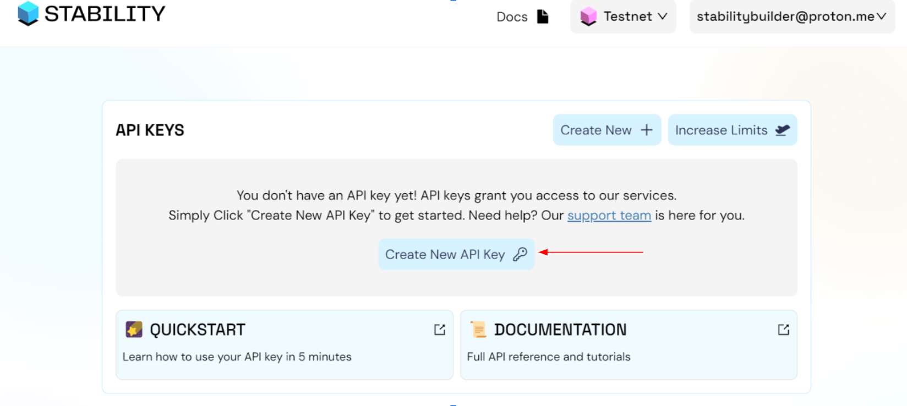

# Getting Started

This quickstart is tailored for developers eager to connect with and explore the capabilities of the Stability Testnet and Global Trust Network (GTN) directly. This guide is designed for developers aiming to craft decentralized applications (dApps), enthusiasts keen on engaging with Stability's blockchain, and anyone interested in understanding what sets Stability apart from traditional EVMs and smart contracts.

## Prerequisites

This tutorial presumes a foundational understanding of blockchain technology and familiarity with tools that interact directly with the blockchain. For example, smart contracts and development tools such as Remix and Viem.

## Register for an API Key

The Stability Network employs API keys to manage transactions. Currently, each address is given a limited number of free transactions without an API key using our public RPC. However, to increase the number of transactions that a certain user can execute, users are required to sign up with our [Account Manager](https://account.stabilityprotocol.com/keys) for their very own private RPC address.

### Step 1: Register on Stability's Account Manager


To begin, navigate to Stability's [Account Manager](https://account.stabilityprotocol.com/keys) page and select your preferred method of registration. To receive a dedicated API key, you must register using either Github, Google, or Email. It's important to note that registrations through Metamask or Magiclink do not provide a dedicated API key.

If you opt to register via email, ensure to verify your email address. Verification is required each time you log in for added security.

### Step 2: Generate Your API Key



Once logged in to Stability's Account Manager, locate the option for generating an API key. Click on the designated button to create your unique API key.

With your API key, you're now equipped to utilize your private RPC on Stability. Click the info button to reveal your private RPC address. Plus, you'll receive 2,000 free credits monthly with your API key, which can be used for any transactions you choose.

### Step 3: Ready to Go!

Congratulations! You've successfully created an API key on Stability's Account Manager. Now, you're all set to use Stability at no cost. Utilize your private RPC to interact with the Stability network using wallets such as Metamask or frameworks like Viem or Ethers.js.


# What Is Different In Stability

One of the key differences with Stability is its lack of a native token. This fundamental change affects the execution of transactions that typically involve the transfer of native tokens, which is a core functionality in many Ethereum-based applications. As a result, developers will find that some standard operations and Solidity functionalities will not work as expected on Stability.

## Known Differences

### Native Token Value Transfers

On Stability, functions intended for transferring native gas tokens, such as `.transfer`, `.send`, and any operations involving `msg.value`, are not supported. Attempts to execute such transactions will automatically revert. This is a significant departure from traditional Ethereum-based smart contract interactions, where these methods are commonly used to manage and transfer Ether between accounts. For instance, the following Solidity code snippets illustrate transactions that would **fail** on Stability:

```bash
function sendViaTransfer(address payable _to) public payable {
    _to.transfer(msg.value);
}
>> FAIL

function sendViaSend(address payable _to) public payable {
    bool sent = _to.send(msg.value);
    require(sent, "Failed to send Ether");
}
>> FAIL

function sendViaCall(address payable _to) public payable {
    (bool sent, bytes memory data) = _to.call{value: msg.value}("");
    require(sent, "Failed to send Ether");
}
>> FAIL
```

### Address Balance

On Stability, the address.balance operation will not function as expected. This operation, which is used to retrieve the balance of Ether (or any native token) held by an address, relies on the existence of a native token. For example:

```bash
function getBalance() public view returns (uint) {
        return address(this).balance;
    }
>> Returns the selected DNT balance
```

### Payable Declarations

In the context of Stability, declaring functions and addresses as payable is unnecessary since the blockchain does not support native token transactions. Instead, developers should utilize the ERC-20 token standard for transactions involving token transfers. This approach involves first approving the transfer of tokens to a contract, followed by the contract executing the transfer, mirroring the functionality provided by ERC-20 tokens.

### Receive() and Fallback()

The receive() and fallback() functions in Solidity are designed to handle incoming transactions and unspecified function calls, respectively. However, without the capability to transfer native tokens, these functions lose their primary purpose on Stability. Developers will need to consider alternative methods for contract interactions that do not rely on direct value transfers.

## Now Start Swimming
Armed with this knowledge and your API key, you're well-prepared to embark on your development journey with the Stability Network. Dive in and start innovating! Happy hacking!