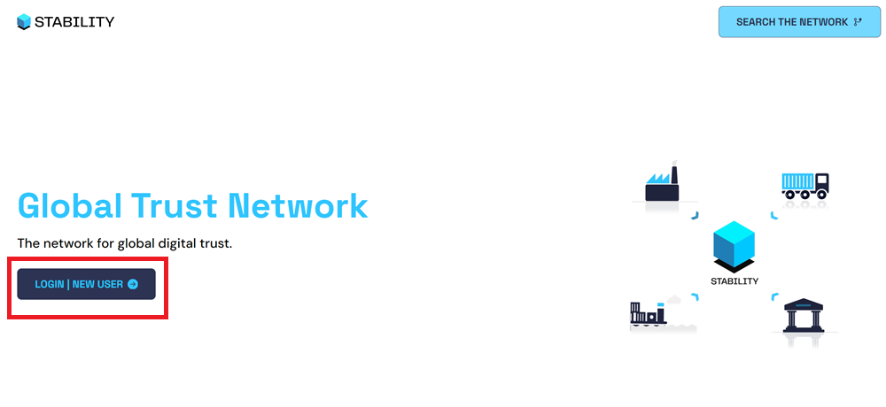
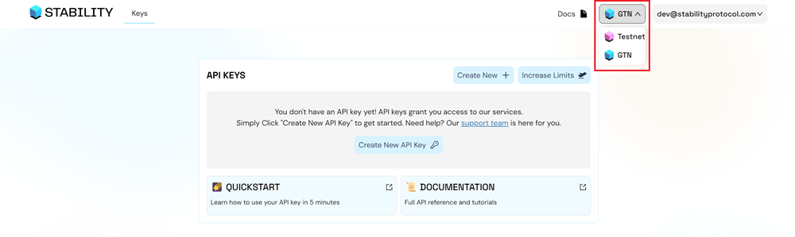
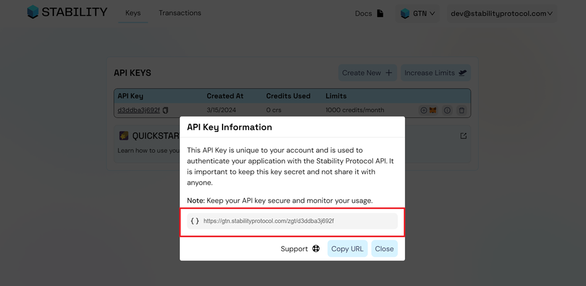

# Getting Started

This quickstart is tailored for developers eager to connect with and explore the capabilities of the Stability Testnet and Global Trust Network (GTN) directly. This guide is designed for developers aiming to craft decentralized applications (dApps), enthusiasts keen on engaging with Stability's blockchain, and anyone interested in understanding what sets Stability apart from traditional EVMs and smart contracts.

## Prerequisites

This tutorial presumes a foundational understanding of blockchain technology and familiarity with tools that interact directly with the blockchain. For example, smart contracts and development tools such as Remix and Viem.

## Register for an API Key

Global Trust Network (GTN) and Stability Testnet employ API keys to manage transactions. On Global Trust Network, an API key is required to perform write transactions. On Stability Testnet, each address is given a limited number of free transactions without an API key using our public RPC. To increase the number of transactions that a certain user can execute on either chain, users are required to sign up with our [Account Manager](https://account.stabilityprotocol.com/keys) for their very own private RPC address.

### 2. Sign Up For An API Key

#### Step 1 - Navigate to [Stability Portal](https://portal.stabilityprotocol.com/) and click the `Login | New User' button.

#### Step 2 - Select Your Preferred Registration

On this screen, select your preferred method of registration. For this tutorial, we will be following the Google sign-in path. You may also similarly log in via Email, GitHub, Magiclink, or directly through Metamask.  

It is important to note that registrations through Metamask or Magiclink do not provide a dedicated API Key. Without an API Key, you will not be able to perform transactions on Global Trust Network (GTN), and will have limited functionality on Stability Testnet. To receive an API Key, you must register using either GitHub, Google, or Email. 

If you opt to register via email, ensure you can verify your email address.

#### Step 3 - Select Your Preferred Network

Using the dropdown menu on the top right, select the network you wish to generate an API Key on.

#### Step 4 - Click the `Create New API Key` Button

#### Step 5 - Congrats! You've created an API Key.

To view your personal RPC URL, click the `Info` button.

Here, you will find your personal RPC URL.

### 3. Review What Is Different With Stability

We highly recommend reviewing the section on [What Is Different](./what_is_different.md) regarding Stability as opposed to traditional Ethereum Virtual Machine (EVM) blockchains. Understanding these distinctions is crucial for developers looking to create decentralized applications (dApps) on the Stability platform, especially since certain functionalities, like native token transfers, will not operate in the same way on Stability.

## Now Start Swimming
Armed with this knowledge and your API key, you're well-prepared to embark on your development journey with the Stability Network. Dive in and start innovating! Happy hacking!