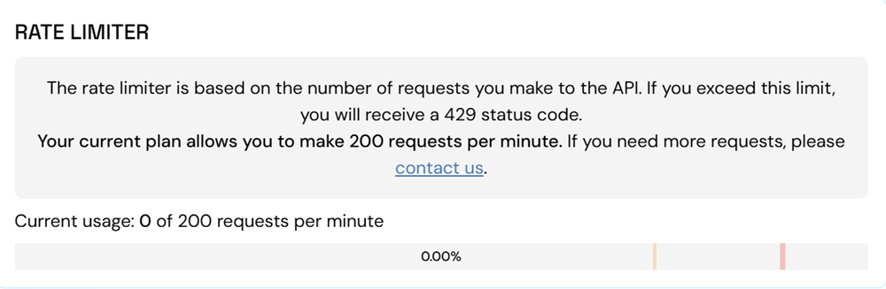

# RPC Rate Limits

Our RPC endpoint enforces a rate limit of **60 requests per minute** for the free tier. If your usage exceeds this limit, additional requests within the same rolling minute will be blocked, and return a 429 status code. The limit will reset at the end of the rolling minute. We also offer paid tiers with higher request allowances for high-volume or enterprise-level needs.

## What is a Request?

A “request” is any individual call made to the RPC endpoint. Each operation—whether retrieving the latest block number, submitting a transaction, or querying transaction details—counts toward this total. Even if your application is executing a single user action (e.g., sending a transaction on the blockchain), it may internally make multiple RPC calls.

Keep an eye on your usage to avoid hitting the 60 requests-per-minute cap. You can track your current usage per a minute in your [Stability Portal](https://portal.stabilityprotocol.com/). If you anticipate higher throughput, please consider one of our paid tiers with enhanced rate limits.

## How to Increase Limits?

To increase your limits, click the **Increase Limits** button in the [Stability Portal](https://portal.stabilityprotocol.com/) to contact us. Our starting tier allows for **200 requests per minute**, with higher options available for customized plans.
