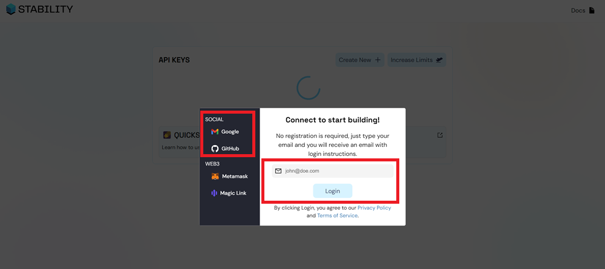
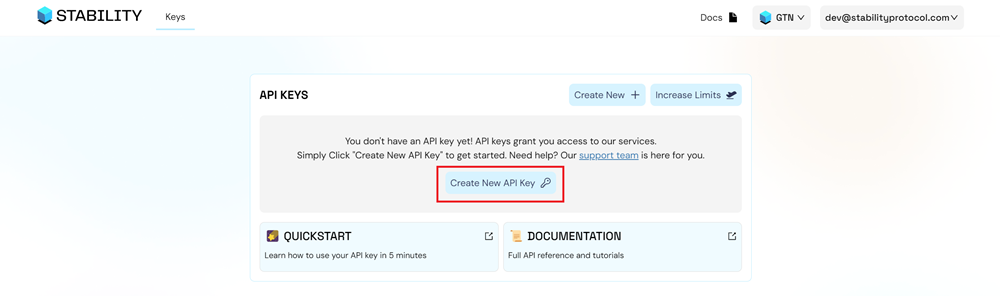
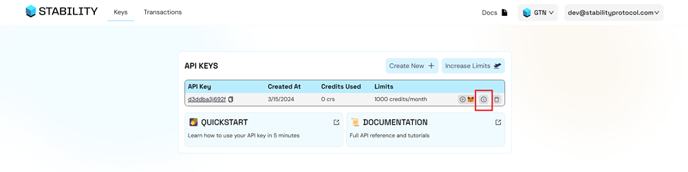

# API Keys

In this tutorial, you will learn how to create an API key on Stability's Account Manager.

Why do you need to have an API key for using Stability? Our open version of the API is limited so a certain amount of transactions (sometimes this amount could be zero) for each address. To increase the number of transactions that a certain user can execute we would have to require users to sign up to our **Account Manager** so we prevent malicious users to execute an unlimitted number of transactions.

### 2. Sign Up For An API Key

#### Step 1 - Navigate to [Stability Portal](https://portal.stabilityprotocol.com/) and click the `Login | New User' button.

#### Step 2 - Select Your Preferred Registration

On this screen, select your preferred method of registration. For this tutorial, we will be following the Google sign-in path. You may also similarly log in via Email, GitHub, Magiclink, or directly through Metamask.  

It is important to note that registrations through Metamask or Magiclink do not provide a dedicated API Key. Without an API Key, you will not be able to perform transactions on Global Trust Network (GTN), and will have limited functionality on Stability Testnet. To receive an API Key, you must register using either GitHub, Google, or Email. 

If you opt to register via email, ensure you can verify your email address.

#### Step 3 - Select Your Preferred Network

Using the dropdown menu on the top right, select the network you wish to generate an API Key on.

#### Step 4 - Click the `Create New API Key` Button

#### Step 5 - Congrats! You've created an API Key.

To view your personal RPC URL, click the `Info` button.

Here, you will find your personal RPC URL.

## Step 3: Ready to Go!

Congratulations! You've successfully created an API key on Stability's Account Manager. Now, you're all set to use Stability at no cost. Utilize your private RPC to interact with the Stability network using wallets such as Metamask or frameworks like Viem or Ethers.js.
