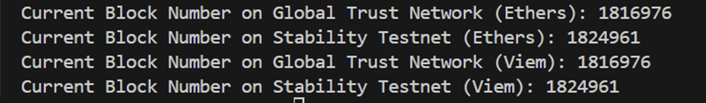

# Stability SDK

## Overview

The Stability SDK facilitates easy TypeScript integrations into existing codebases. This SDK includes pre-configured network settings for both the Stability Testnet and the Global Trust Network (GTN), designed to work seamlessly with `ethers.js` v6.11.1 and `viem` v2.9.15. It is essential to verify the versions of `ethers.js` and `viem` you are using to ensure compatibility with the SDK configurations.

Please visit [ethers.js documentation](https://ethers.org/) and [viem documentation](https://viem.sh/) for more detailed information on each library.

### Key Features

- **Pre-configured Network Settings**: Includes ready-to-use configurations for interacting with the Stability Testnet and GTN.
- **Seamless Integration**: Designed to integrate smoothly with `ethers.js` and `viem`, facilitating blockchain operations without extensive setup.
- **TypeScript Support**: Enhances development efficiency and type safety for TypeScript projects.


## Installation 

If starting a new project, open your terminal, create a new folder, and initialize a new project with:

```bash
npm init
```

To incorporate the Stability SDK into your existing codebase, use your preferred package manager to install the Stability Provider package. This package includes all necessary network configurations and imports for quick usage with ethers.js and viem.

In the root folder of your project, execute the following command:

#### Using NPM:
```bash
npm i @stabilityprotocol/provider
```

#### Using Yarn:
```bash
yarn add @stabilityprotocol/provider
```

To import the necessary configurations into your application, use the following line of code:
```typescript
import { StabilityGtnRpcProviderEthers, StabilityTestnetRpcProviderEthers, createStabilityTestnetClientViem, createStabilityGtnClientViem } from "@stabilityprotocol/provider";
```

Best Practice: Import only the configurations you need. For instance, if you only plan to use the Stability Testnet with the `viem` library:
```typescript
import { createStabilityTestnetClientViem } from "@stabilityprotocol/provider";
```
## Example

Let's see the SDK in action.

In the root folder of your project, create a new file named test.ts. This TypeScript test code will use each of the four imports to retrieve the current block number.

Copy and paste the following TypeScript code:
```typescript
import {
  StabilityGtnRpcProviderEthers,
  StabilityTestnetRpcProviderEthers,
  createStabilityGtnClientViem,
  createStabilityTestnetClientViem,
} from "@stabilityprotocol/provider";

// API key configuration
const apiKey = "YOUR_API_KEY"; // Sign up to get an API key at https://portal.stabilityprotocol.com

// Ethers provider instances
const gtnEthersProvider = new StabilityGtnRpcProviderEthers(apiKey); // Provider for Global Trust Network using Ethers
const testnetEthersProvider = new StabilityTestnetRpcProviderEthers(); // Provider for Stability Testnet using Ethers

// Viem client instances
const gtnViemClient = createStabilityGtnClientViem(apiKey); // Client for Global Trust Network using Viem
const testnetViemClient = createStabilityTestnetClientViem(); // Client for Stability Testnet using Viem

// Function to print the current block numbers from various providers and clients
async function printCurrentBlockNumbers() {
  const blockNumberGtnEthers = await gtnEthersProvider.getBlockNumber();
  console.log(
    `Current Block Number on Global Trust Network (Ethers): ${blockNumberGtnEthers}`
  );

  const blockNumberTestnetEthers = await testnetEthersProvider.getBlockNumber();
  console.log(
    `Current Block Number on Stability Testnet (Ethers): ${blockNumberTestnetEthers}`
  );

  const blockNumberGtnViem = await gtnViemClient.getBlockNumber();
  console.log(
    `Current Block Number on Global Trust Network (Viem): ${blockNumberGtnViem}`
  );

  const blockNumberTestnetViem = await testnetViemClient.getBlockNumber();
  console.log(
    `Current Block Number on Stability Testnet (Viem): ${blockNumberTestnetViem}`
  );
}

// Execute the function to print block numbers
printCurrentBlockNumbers();
```

Then, run the code using ts-node. In the terminal where your `test.ts` file is located, run the following command:

```bash
npx ts-node test.ts
```

If all goes well, you should see the following in your console:



Congratulations! You are now ready to utilize the SDK for easy interactions with the Stability Testnet and Global Trust Network (GTN)!