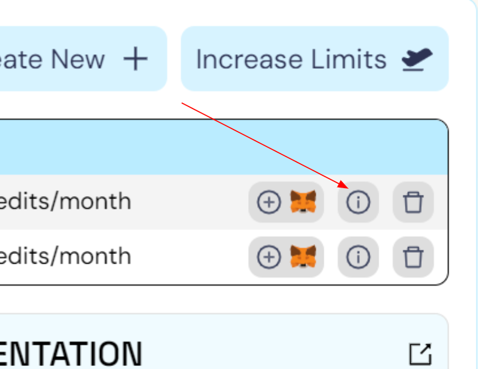

# Deploy Contract Using Hardhat

## 1. Introduction

### Tutorial Objective

This tutorial teaches how to deploy an ERC20 Smart Contract on Stability Testnet using Hardhat and TypeScript.

### Prerequisites

- Basic knowledge of programming, blockchain, and TypeScript.
- Node.js and NPM installed on your system.
- A text editor or IDE for development.

### More Information

The complete code of this tutorial can be found at this [link](https://github.com/stabilityprotocol/tutorials/tree/main/deploy-using-hardhat)

## 2. Get an Api Key

On Stability, we have created a system where transactions don’t require gas. Instead, our users need to have an API key that identifies them. To get your first API key, you need to visit this website: [link](https://account.stabilityprotocol.com/zgt)

When you visit this website, you will see something similar to this:


You need to choose a login method. You can use a conventional login like email or GitHub, or if you prefer, a more blockchain-oriented login like MetaMask. The choice is yours.

Once you are logged in, click on the 'Create New' button. After this, an API key will appear in the table.


Now, you have an API Key completely ready for use. Click the Info button to reveal your API Key.



And there it is! Copy this API key for later. You can always come back to this page to access again in the future.


## 3. Setting Up the Development Environment

### Installation of Node.js and NPM

Make sure you have Node.js and NPM. You can download them from [Node.js](https://nodejs.org/).

## 4. Creation and Configuration of the ERC20 Project

### Initializing the Project with Hardhat

Create a new directory for your project and navigate to it in your terminal. Run the following commands to start your hardhat project and install some dependencies:

```bash
npm init --y
npm install --save-dev hardhat typescript ts-node @nomiclabs/hardhat-ethers ethers @nomicfoundation/hardhat-toolbox hardhat-dependency-compiler
npx hardhat init
```

Select “Create a TypeScript project” when prompted.

When creating the project in hardhat, it will be created with 1 example contract called `Lock.sol`, delete it and also delete its test file.

### Creating the ERC20 Smart Contract in TypeScript

In the contracts directory, create a new file called MyERC20.sol. Then install the dependencies for this contract:

```
npm install @openzeppelin/contracts
```

and paste the following code:

```
// SPDX-License-Identifier: MIT
pragma solidity ^0.8.0;

import "@openzeppelin/contracts/token/ERC20/ERC20.sol";

contract MyERC20 is ERC20 {
    constructor(uint256 initialSupply) ERC20("MyToken", "MTK") {
        _mint(msg.sender, initialSupply);
    }
}
```

## 5. Deployment of the Smart Contract on Stability Testnet

### Configuration of the hardhat.config.ts File

Edit `hardhat.config.ts` to include Stability Testnet. Replace `YOUR_API_KEY` with the api key obtained in step 2

```ts
import { HardhatUserConfig } from "hardhat/config";

const config: HardhatUserConfig = {
  solidity: "0.8.20",
  networks: {
    stabilityprotocol: {
      url: "https://free.testnet.stabilityprotocol.com/?api_key={YOUR_API_KEY}",
      accounts: [
        "f64a9d6c862031a967d2f062d73e5c2b25370180e4acd51ef510c2c25cbb0682", // Replace this for your private key. This is a random private key for tutorial purposes
      ],
    },
  },
};

export default config;
```

### Compiling and Deploying the Contract

Compile the contract:

```bash
npx hardhat compile
```

Create a deployment script in the scripts directory. For example, deploy.ts:

```ts
import { ethers } from "hardhat";

async function main() {
  const MyERC20 = await ethers.getContractFactory("MyERC20");
  const myERC20 = await MyERC20.deploy("1000000", {
    maxFeePerGas: 0,
  });

  await myERC20.deployed();

  console.log("MyERC20 deployed to:", myERC20.address);
}

main().catch((error) => {
  console.error(error);
  process.exit(1);
});
```

Deploy with:

```bash
npx hardhat run scripts/deploy.ts --network stabilityprotocol
```

After executing this command, the command console will return a message like this:

```
MyERC20 deployed to: 0x......
```

This message means that the contract has been successfully deployed.

If you now take that address and search for it in the Stability block explorer, you will see something similar to this:


### Congrats!

Deploying a contract on the Stability Testnet using Hardhat is very simple, as despite having zero gas transactions, the network maintains EVM compatibility, which allows using all existing tools in the EVM ecosystem to expedite the development of applications.
