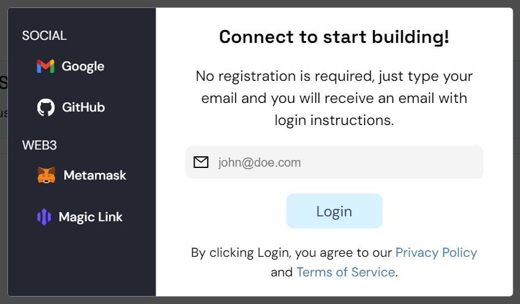
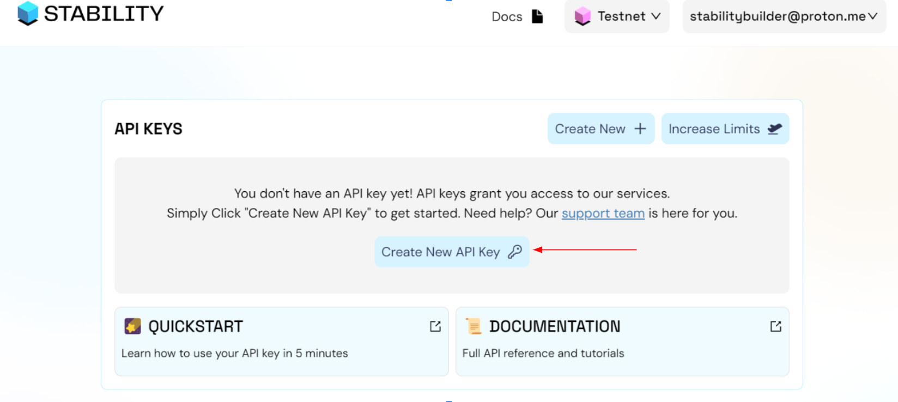
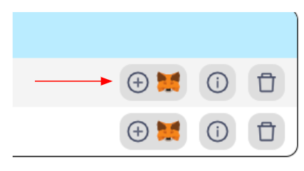
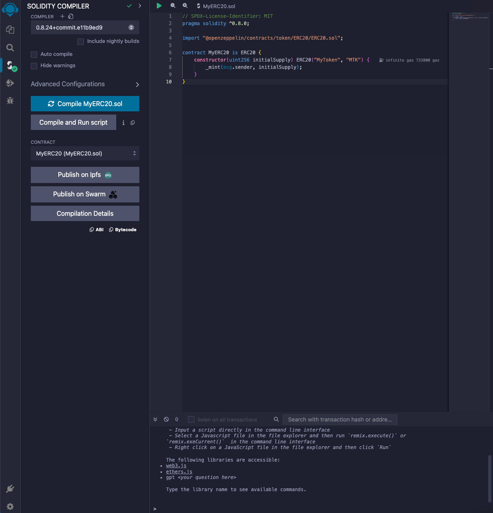
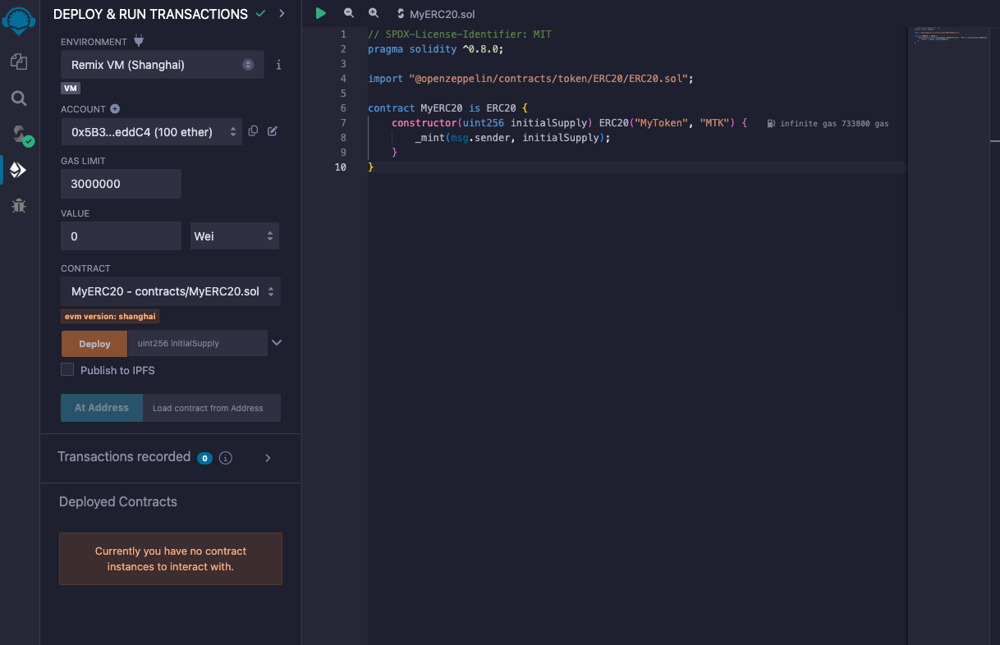
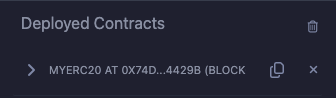
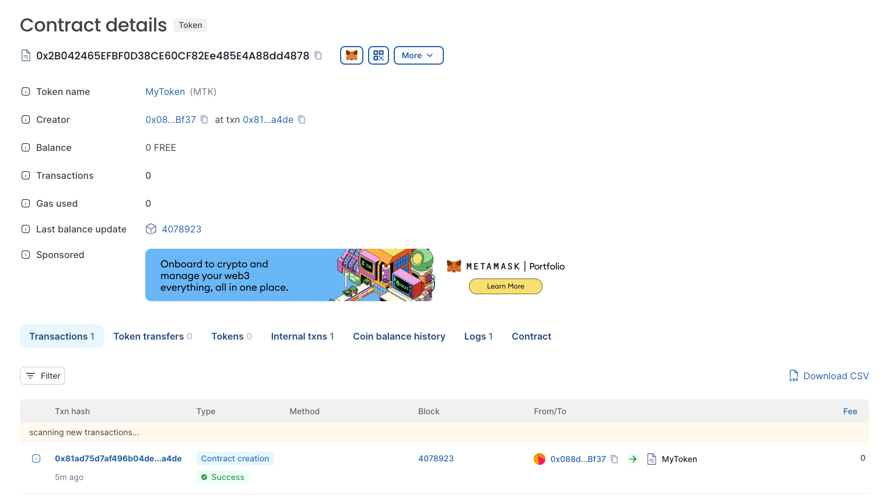

# Deploy Contract Using Remix

## 1. Introduction

### Tutorial Objective

This tutorial teaches how to deploy an ERC20 Smart Contract on the Stability Testnet using Remix IDE.

Remix is an online smart contract IDE that does not require installation.

### Prerequisites

- Basic knowledge of programming and blockchain
- Metamask installed

### 2. Sign Up For An API Key

After installation, you need to add Stability Testnet to MetaMask. This requires registering for an API Key.



To begin, navigate to Stability's [Account Manager](https://account.stabilityprotocol.com/keys) page and select your preferred method of registration. To receive an API key, you must register using either Github, Google, or Email. If you opt to register via email, ensure you are able to verify your email address.

It's important to note that registrations through Metamask or Magiclink do not provide a dedicated API key.



Once logged in to Stability's [Account Manager](https://account.stabilityprotocol.com/keys), locate the option for generating an API key. Click on the designated button to create your unique API key.

### 3a. Add Network to Metamask + Other Compatible Wallets



    To add your custom RPC to your browser extension wallet, click the Metamask Fox Logo next to your API Key. This will work with Metamask as well as many Browser-extension based wallet. 
    - Note: You may encounter a warning regarding the currency symbol. This is expected, as the Stability Testnet does not use a currency for gas fees. The network can be used without a currency balance.

    If you are not able to add the network to your wallet, you may have to add the network manually. Follow the instructions below.

### 3b. Add Network Manually to a Wallet

    In the event your wallet in not compatible with adding chains via Javascript, you can add the following details to your wallet.
    Replace the 'YOUR_API_KEY' with your own API key.

**For Stability Testnet**

| **Property**           | **Value**                                                            |
|------------------------|----------------------------------------------------------------------|
| Network Name           | Stability Test Net                                                   |
| New RPC URL            | `https://free.testnet.stabilityprotocol.com/?api_key=YOUR_API_KEY` |
| Chain ID               | 20180427                                                             |
| Currency Symbol        | FREE                                                                 |
| Block Explorer URL     | `https://stability-testnet.blockscout.com/`   


   - Note: You may encounter a warning regarding the currency symbol. This is expected, as the Stability network does not use a currency for gas fees. The network can be used without a currency balance.


## 4. Setting Up Remix

First, navigate to [Remix IDE](https://remix.ethereum.org/)

Once you are in Remix, create a file inside the 'contracts' folder. For this tutorial, we are going to deploy an ERC20 token, so we will name it 'MyERC20.sol'.

In this file, paste the following code:

```
// SPDX-License-Identifier: MIT
pragma solidity ^0.8.0;

import "@openzeppelin/contracts/token/ERC20/ERC20.sol";

contract MyERC20 is ERC20 {
    constructor(uint256 initialSupply) ERC20("MyToken", "MTK") {
        _mint(msg.sender, initialSupply);
    }
}
```

## 5. Compile contract

Once your contract is finished, you need to compile it. To do this, click on the `Solidity Compiler` option in the left sidebar. You will see something like this:



Then, click on the `Compile MyERC20.sol` button.

Now, your contract is successfully compiled.

## 6. Deploy

Now you need to deploy it. To do this, navigate to the `Deploy & Run Transactions` section using the left sidebar.

There, you will see something like this:



Select `Injected Provider - MetaMask` in the `ENVIRONMENT` input.

In the `Contract` section, choose `MyERC20`.

Then, you will need to set the initial supply of our token, as it is a required variable in the constructor method of the MyERC20 contract.

For example, set the initial supply to `1000000`.

After typing the initial supply, click on the orange button. A MetaMask popover will appear; click on `Confirm` and wait.

After a moment, the contract will be deployed, and you will see something like this:



Congratulations! You now have a smart contract deployed.

If you search for that address in the Stability block explorer, you will see something similar to this:



### Conclusion

Deploying a contract on the Stability network using Remix is very simple, as despite having zero gas transactions, the network maintains EVM compatibility, which allows using all existing tools in the EVM ecosystem to expedite the development of applications.
