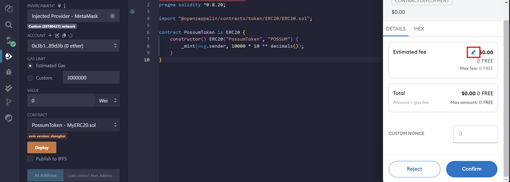

# Deploy Contract Using Remix

## 1. Introduction

### Tutorial Objective

This tutorial will guide you through deploying an ERC20 smart contract on the Global Trust Network (GTN) using the Remix IDE, an online smart contract development environment that requires no installation.

### Prerequisites

- Basic knowledge of programming and blockchain.
- MetaMask installed and configured.

## 2. Sign Up for an API Key


Before starting, ensure you have an API key. Refer to the [getting started](../../getting_started.md)documentation to sign up for an API key and add the Global Trust Network (GTN) to MetaMask.

## 3. Setting Up Remix

Navigate to [Remix IDE](https://remix.ethereum.org/)


In Remix, create a new file by clicking the icon highlighted in the screenshot. Name your file `MyERC20.sol` and prepare to deploy an ERC20 token named `PossumToken` with the ticker symbol `POSSUM`.

Paste the following code into your file:

```
// SPDX-License-Identifier: MIT
// Compatible with OpenZeppelin Contracts ^5.0.0
pragma solidity ^0.8.20;

import "@openzeppelin/contracts/token/ERC20/ERC20.sol";

contract PossumToken is ERC20 {
    constructor() ERC20("PossumToken", "POSSUM") {
        _mint(msg.sender, 10000 * 10 ** decimals());
    }
}
```

## 4. Compile the Contract

To compile your contract, select the Solidity Compiler from the left sidebar in Remix.


Click on the Compile MyERC20.sol button. Your contract should now be compiled successfully.

## 5. Deploy

To deploy the contract, go to the Deploy & Run Transactions section in the left sidebar.


Set the `ENVIRONMENT` to `Injected Provider - MetaMask`.

Under the `Contract` dropdown, select `MyERC20`, and then click the orange deploy button.
A MetaMask popup will appear. Click the pencil icon in the estimated fee box.



This will allow you to customize Metamask for zero gas transactions. Click the advanced gas fee icon. Set your `Max Base Fee` and `Priority Fee` to zero. Click the `Save these values as my default...` checkbox to avoid having to manually set the gas in the future. 


Once deployed, you will see a confirmation like this:


Congratulations! Your smart contract is now deployed. 

To view your token, visit the [Global Trust Network's block explorer](https://stability.blockscout.com/), then copy and paste your contract's address.

