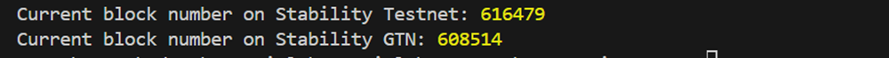

# Setting Up Stability in Ethers

## 1. Introduction

This guide will demonstrate the steps to install Ethers.js and configure the framework for interacting with the Stability Testnet and Global Trust Network (GTN). Ethers.js is a widely used library that enables developers to interact with the Ethereum blockchain and its ecosystem, including custom networks like Stability, in a simple and intuitive way using JavaScript.

### Prerequisites

- Basic knowledge of programming, blockchain, and JavaScript.
- Node.js and NPM installed on your system.
- A code editor (IDE), such as Visual Studio Code.

The complete code of this tutorial can be found at this [link](https://github.com/stabilityprotocol/tutorials/tree/main/setup-ethers-environment).

This tutorial will work using only the Public RPCs, as they are sufficient for performing 'read' transactions. However, if you have not done so, review the developer [getting started](../../getting_started.md) documentation to create your own API Key. This API key is required to perform any 'write' transactions on the Global Trust Network (GTN), as well as for performing a significant number of transactions on the Stability Testnet.

## 2. About Ethers

Ethers.js is a compact, complete library for interacting with the Ethereum Blockchain and its ecosystem. It provides a set of tools and functions to connect to standard Ethereum networks, as well as custom ones like the Stability Testnet and Global Trust Network (GTN), making it an ideal choice for blockchain development. Ethers.js simplifies the process of sending transactions, interacting with smart contracts, and handling blockchain data, ensuring developers have a powerful yet straightforward interface for blockchain-based projects.

## 3. Environment

For this setup, we'll be utilizing npm and ethers. This combination allows us to write and execute JavaScript directly, facilitating rapid development and testing within the Stability ecosystem.

## 4. Install

Begin by installing ethers via npm. This step ensures that you have the necessary tools that interact with Stability Testnet and Global Trust Network (GTN) using Javascript.

```bash
npm install ethers
```

## 5. Create an `index.js` File

Next, create a JavaScript file named `index.js` and paste the following code. This script configures Ethers to connect to the Stability Testnet and Global Trust Network (GTN), allowing you to read from the blockchain. In this example, we will retrieve the current block number.

```bash

const { JsonRpcProvider } = require('ethers');

const providerTest = new JsonRpcProvider("https://free.testnet.stabilityprotocol.com");
const providerGTN = new JsonRpcProvider("https://gtn.stabilityprotocol.com");

const logCurrentBlockNumbers = async () => {
  try {
    const blockNumber = await providerTest.getBlockNumber();
    console.log("Current block number on Stability Testnet:", blockNumber);
  } catch (error) {
    console.error("Error fetching the current block number on Stability Testnet:", error);
  }
  try {
    const blockNumber = await providerGTN.getBlockNumber();
    console.log("Current block number on Stability GTN:", blockNumber);
  } catch (error) {
    console.error("Error fetching the current block number on Stability GTN:", error);
  }
};

logCurrentBlockNumbers();
```

## 6. Test in Console

To verify your setup, execute the test script using Node.js. This command will run the `index.js` file, outputting the current block number of the Stability Testnet to the console.

```bash
node index.js
```

Upon successful execution, you should see a console log displaying the current block numbers of Stability Testnet and Global Trust Network (GTN). This step confirms that your JavaScript / Ethers setup is correctly configured to interact with the blockchains.



