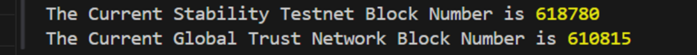

# Setting Up Stability in Viem

## 1. Introduction

This guide will demonstrate the steps to install Viem and configure the framework for interacting with the Stability Testnet and Global Trust Network (GTN). Viem offers a streamlined approach for Ethereum developers looking to engage with Stability, ensuring a smooth development experience.

### Prerequisites

- Basic knowledge of programming, blockchain, and TypeScript.
- Node.js, TypeScript and NPM installed on your system.
- A code editor (IDE), such as Visual Studio Code.

The complete code of this tutorial can be found at this [link](https://github.com/stabilityprotocol/tutorials/tree/main/setup-viem-environment).

This tutorial will work using only the Public RPCs, as they are sufficient for performing 'read' transactions. However, if you have not done so already, review the developer [getting started](../../getting_started.md) documentation to create your own API Key. This API key is required to perform any 'write' transactions on the Global Trust Network (GTN), as well as for performing a significant number of transactions on the Stability Testnet.

## 2. About Viem

Viem is a TypeScript interface tailored for interacting with web3, designed to provide developers with low-level, stateless primitives for seamless interaction with blockchains. Key focuses of Viem include:

- Enhancing the developer experience by simplifying complex blockchain interactions.
- Ensuring stability and reliability in application development.
- Minimizing bundle size to improve application performance and loading times.
- Optimizing for performance to handle high-load scenarios efficiently.

## 3. Environment

For this setup, we'll be utilizing npm, ts-node, and Viem. This combination allows us to write and execute TypeScript directly, facilitating rapid development and testing within the Stability ecosystem.

## 4. Install

Begin by installing Viem and ts-node via npm. This step ensures that you have the necessary tools to create and run TypeScript files that interact with Stability Testnet and Global Trust Network (GTN).

```bash
npm install viem ts-node
```

## 5. Create a `test.ts` File

Next, create a TypeScript file named `test.ts` and paste the following code. This script configures Viem to connect to the Stability Testnet and Global Trust Network (GTN), allowing you to interact with the blockchain. In this example, we will retrieve the current block number. 

The code for this tutorial is kept on a single file for simplicity.

```typescript

import { createPublicClient, http, defineChain } from "viem";

// The following code defines two chains, the Stability Testnet and the Global Trust Network.
const stbleTestnet = defineChain({
  id: 20180427,
  name: "Stability Testnet",
  network: "stability-testnet",
  nativeCurrency: {
    decimals: 18,
    name: "FREE",
    symbol: "FREE",
  },
  testnet: true,
  blockExplorers: {
    default: {
      name: "Stability Testnet",
      url: "https://explorer.stble.io/testnet",
    },
  },
  rpcUrls: {
    default: {
      http: ["https://rpc.testnet.stabilityprotocol.com"],
    },
    public: {
      http: ["https://rpc.testnet.stabilityprotocol.com"],
    },
  },
  contracts: {
    multicall3: {
      // https://raw.githubusercontent.com/mds1/multicall/main/src/Multicall3.sol
      address: "0x3ed62137c5DB927cb137c26455969116BF0c23Cb",
      blockCreated: 2318,
    },
  },
});

const globalTrustNetwork = defineChain({
  id: 101010,
  name: "Global Trust Network",
  network: "global-trust-network",
  nativeCurrency: {
    decimals: 18,
    name: "FREE",
    symbol: "FREE",
  },
  testnet: true,
  blockExplorers: {
    default: {
      name: "Global Trust Network",
      url: "https://stability.blockscout.com/",
    },
  },
  rpcUrls: {
    default: {
      http: ["https://rpc.stabilityprotocol.com"],
    },
    public: {
      http: ["https://rpc.stabilityprotocol.com"],
    },
  },
  contracts: {
    multicall3: {
      // https://raw.githubusercontent.com/mds1/multicall/main/src/Multicall3.sol
      address: "0xBA2923DAe45aD6b8B77bff4733c75b0C13F0ce2d",
      blockCreated: 3101,
    },
  },
});

// The following code creates two clients, one for the Stability Testnet and one for the Global Trust Network.
const testnetClient = createPublicClient({
  chain: stbleTestnet,
  transport: http(),
});

const gtnClient = createPublicClient({
  chain: globalTrustNetwork,
  transport: http(),
});

// The following code retrieves the current block numbers for the Stability Testnet and the Global Trust Network.
async function getBlockNumbers() {
  const testnetBlockNumber = Number(await testnetClient.getBlockNumber());
  const gtnBlockNumber = Number(await gtnClient.getBlockNumber());
  return { testnetBlockNumber, gtnBlockNumber };
}

// The following code logs the current block numbers for the Stability Testnet and the Global Trust Network in console.
getBlockNumbers().then(({ testnetBlockNumber, gtnBlockNumber }) => {
  console.log(
    "The Current Stability Testnet Block Number is",
    testnetBlockNumber
  );
  console.log(
    "The Current Global Trust Network Block Number is",
    gtnBlockNumber
  );
});

```

## 6. Test in Console

To verify your setup, execute the test script using npx `ts-node`. This command will compile and run your TypeScript file, outputting the current block number of the Stability Testnet to the console.

```bash
npx ts-node test.ts
```

Upon successful execution, you should see a console log displaying the current block numbers of Stability Testnet and Global Trust Network (GTN). This step confirms that your TypeScript / Viem setup is correctly configured to interact with the blockchains.


