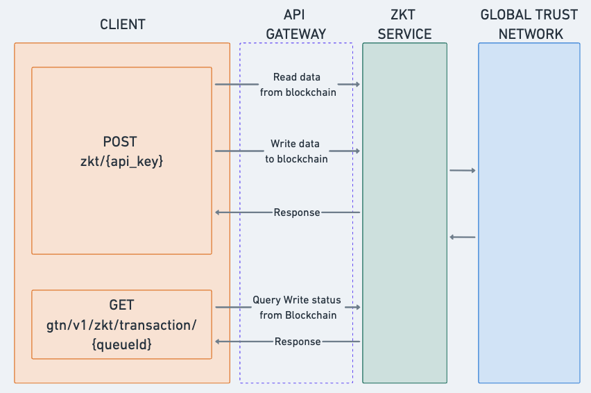

# Overview

**Zero-Knowledge Transactions (ZKT)** is an experimental feature of the Stability Blockchain that simplifies blockchain interactions by allowing users to submit data directly via standard `HTTP POST` requests. This removes the need for complex Web3 libraries, enabling any application capable of making a web request to interact with the blockchain.

- Explore the [Stability Publisher](https://github.com/stabilityprotocol/stability-publisher-dapp) Github repository
- View the Live [Demo](https://stabilityprotocol.github.io/stability-publisher-dapp/) to see ZKT in action.

## Architecture

The **ZKT** solution is architected as a **RESTful service** that acts as a bridge between standard web clients and the Stability Blockchain. This simplifies on-chain interactions for Web2 developers.

Below is a high-level diagram of the ZKT architecture:

**Components:**

- **API Gateway:** Serves as the secure entry point for all ZKT requests, handling:
  - **Authentication:** Verifies requests using your Stability API Key.
  - **Data Validation:** Ensures incoming `JSON` structure is correct and contains required arguments.
  - **Network Routing:** Directs traffic to either the `Testnet` or `GTN (Mainnet)` based on the endpoint used.
- **ZKT Service:** Handles transaction construction, signing, and communication with the blockchain sequencer.
- **Sequencer** Orders and finalizes transactions on the Stability blockchain.

## Getting Started

To start experimenting, we recommend signing up for a free API Key on the [Stability Portal](https://account.stabilityprotocol.com/keys). While a public RPC is available for testing, the private endpoints offer dedicated resources for your application.

**Public RPC Endpoints (limited):**
- **Mainnet**: `https://rpc.stabilityprotocol.com/zkt/try-it-out`
- **Testnet**: `https://rpc.testnet.stabilityprotocol.com/zkt/try-it-out`

### Available Endpoints

- **`POST /zkt/try-it-out`**

  Public endpoint for submitting messages to the blockchain. Note this endpoint may be limited. Transactions submitted here are signed by a single account: `0x7f521250d3aacba194dbb33427ffea2c546b433d`.  
  _You can view this account on our [Testnet Explorer](https://explorer.stble.io/testnet/address/0x7f521250d3aacba194dbb33427ffea2c546b433d/) and [Mainnet Explorer](https://stability.blockscout.com/address/0x7F521250d3AAcba194dBB33427fFEa2C546B433d)._

- **`POST /zkt/{your-api-key}`**

  An authenticated endpoint. Transactions submitted here are signed by a unique wallet exclusive to your API Key.

- **`GET /gtn/v1/transaction/{queueId}`**

  Endpoint for checking the status of a submitted transaction. This will be discussed in further detail in [Checking Transaction Status](./transaction_status).

## Security Considerations

- **API Rate Limiting:** Enforced at the API Gateway to prevent spam or denial-of-service attacks.
- **Data Privacy:** Although messages are public, the initiator of the transaction is unknown when using the public key.
- **Max Payload:** The maximum size of a ZKT transaction payload is 1 MB.

## Error Handling

- **Validation Errors:** Returned if the request body is missing required fields or contains incorrect formats.
- **Network Errors:** Handled gracefully with retry logic if the transaction fails to broadcast due to network issues.

---

Now that you understand how ZKT works, let's explore the API and start making requests in the [API Reference](./api_reference) section.
Now that you understand how ZKT works, let's explore the API and start making requests in the [API Reference](./api_reference) section.
