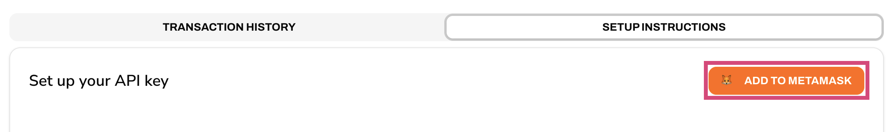
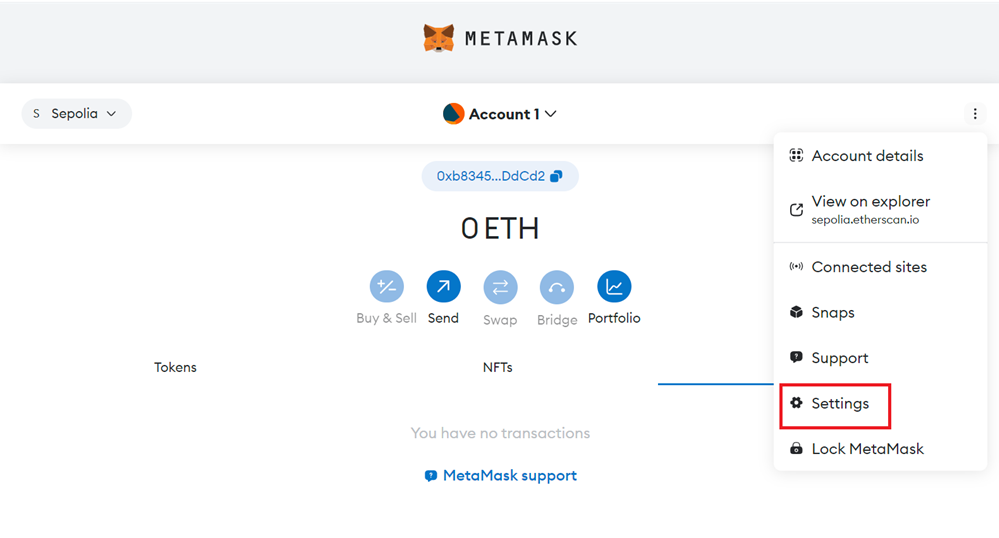
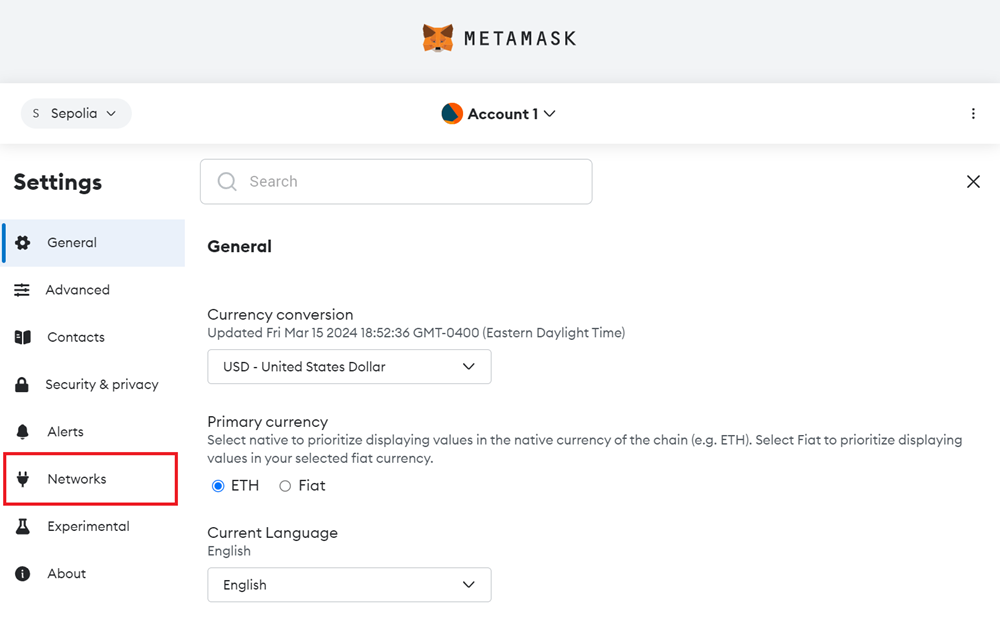
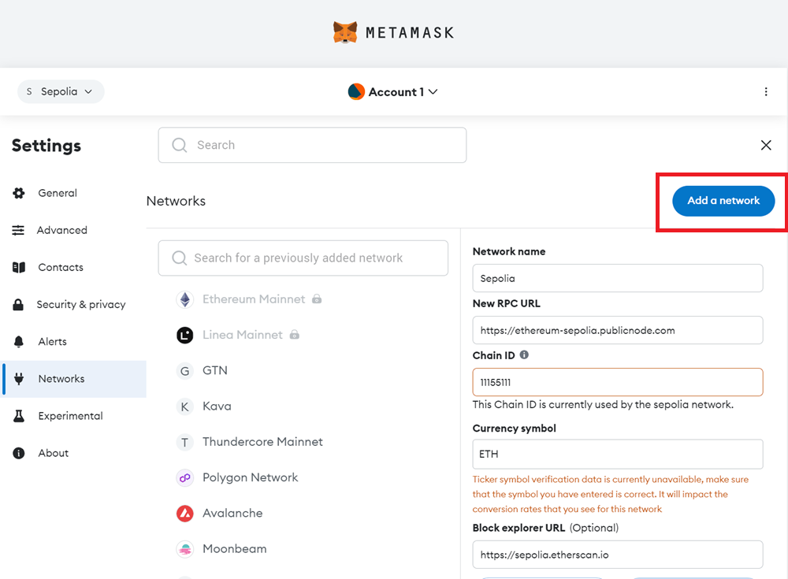
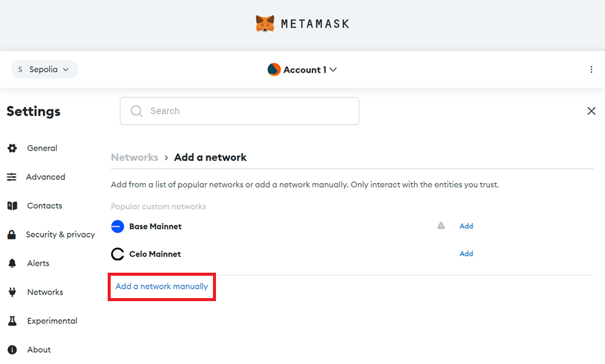
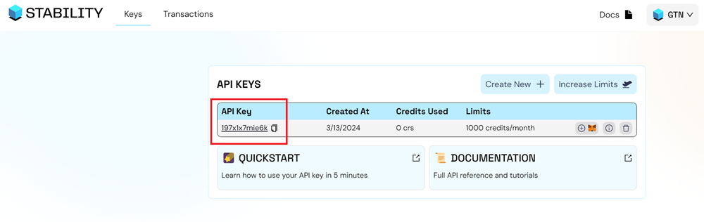
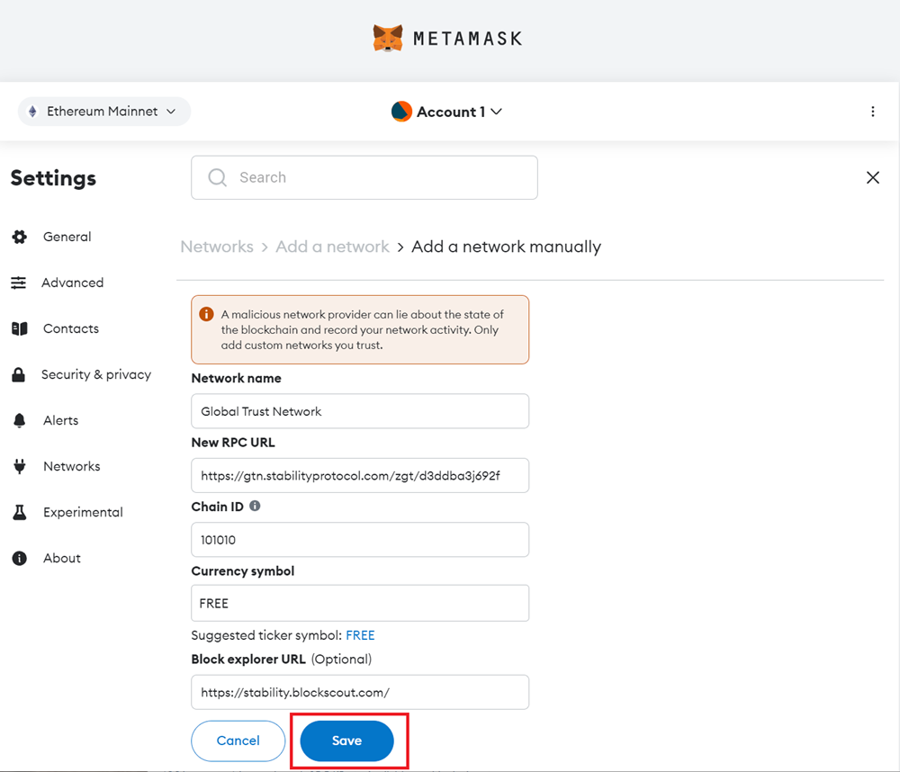

import Tabs from '@theme/Tabs';
import TabItem from '@theme/TabItem';

# MetaMask & API Configuration

This guide will help you set up MetaMask and configure your API key for use with Stability.

## Prerequisites

This tutorial presumes a foundational understanding of blockchain technology and familiarity with tools that interact directly with the blockchain. For example, smart contracts and development tools such as Remix and Viem.

## Register for an API Key

Global Trust Network (GTN) and Stability Testnet employ API keys to manage transactions. On Global Trust Network, an API key is required to perform write transactions. On Stability Testnet, each address is given a limited number of free transactions without an API key using our public RPC. To increase the number of transactions that a certain user can execute on either chain, users are required to sign up with our [Account Manager](https://account.stabilityprotocol.com/keys) for their very own private RPC address. Only an e-mail is required.

For detailed instructions on creating your API key, see [Creating Your API Key](../../../stability_api/creating_api_key.md).

### Quick Setup Steps

#### Step 1 - Navigate to [Stability Portal](https://portal.stabilityprotocol.com/)

#### Step 2 - Select Your Preferred Registration

Select your preferred registration method. Stability supports **Google Sign-in** or **Email registration**.

- _Note: If registering via email, ensure you can verify your address._

#### Step 3 - Select Your Preferred Network - GTN or Testnet

Use the dropdown menu in the top-right corner to select your target environment:

- **GTN (Mainnet)**: For production-ready applications.

- **Testnet**: For development and experimental testing.

#### Step 4 - Click the `Create New Key` Button

#### Step 5 - Congrats! You've created an API Key

To view your personal RPC URL, click the `View Details` button next to your API key, followed by the `Setup Instructions` button.

Here, you will find your personal RPC URL, as well a link that will add either network to your Metamask in one click.

### Add Network to Metamask

#### Add Network Automatically

To add your custom RPC to your browser extension wallet, which will allow you to use Global Trust Network or Stability Testnet, click the `Add To Metamask` button. This will work with Metamask as well as many other browser extension based wallets.

If you are not able to add the network to your wallet, you may have to add the network manually. Follow the instructions below.

#### Add Network Manually to Metamask

In the event you are unable to add your wallet automatically via clicking the Metamask Fox Logo above, or you wish to add the network manually, simply follow the steps below. 

<Tabs>
  <TabItem value="gtn" label="Global Trust Network" default>

| **Property**       | **Value**                                            |
| ------------------ | ---------------------------------------------------- |
| Network Name       | Global Trust Network                                 |
| New RPC URL        | `https://rpc.stabilityprotocol.com/zgt/YOUR_API_KEY` |
| Chain ID           | 101010                                               |
| Currency Symbol    | FREE                                                 |
| Block Explorer URL | `https://stability.blockscout.com/`                  |
| Request Limit      | 60 Per Minute. (Higher Limits Available)             |
| Max Batch Size     | 40                                                   |

  </TabItem>
  <TabItem value="testnet" label="Stability Testnet">

| **Property**       | **Value**                                                    |
| ------------------ | ------------------------------------------------------------ |
| Network Name       | Stability Test Net                                           |
| New RPC URL        | `https://rpc.testnet.stabilityprotocol.com/zgt/YOUR_API_KEY` |
| Chain ID           | 20180427                                                     |
| Currency Symbol    | FREE                                                         |
| Block Explorer URL | `https://testnet.stability.blockscout.com/`                  |
| Request Limit      | 60 Per Minute. (Higher Limits Available)                     |
| Max Batch Size     | 40                                                           |

  </TabItem>
</Tabs>

**Step 1** - Navigate to `Settings` in Metamask.

**Step 2** - Click on the `Networks` tab.

**Step 3** - Click the `Add a network` button.

**Step 4** - Click the `Add a network manually` text link.

**Step 5** - Go to the [Stability Account Manager](https://account.stabilityprotocol.com/keys) and copy your API Key.

**Step 6** - Fill out the network settings using the details below. Be sure to replace the `YOUR_API_KEY` with your own API Key. Afterward, click Save.

## Next Steps

- [Configure MetaMask for Zero Fees](./zero_fees_config.md)
- Review [EVM Compatibility & Solidity Development](../evm_compatibility.md)
