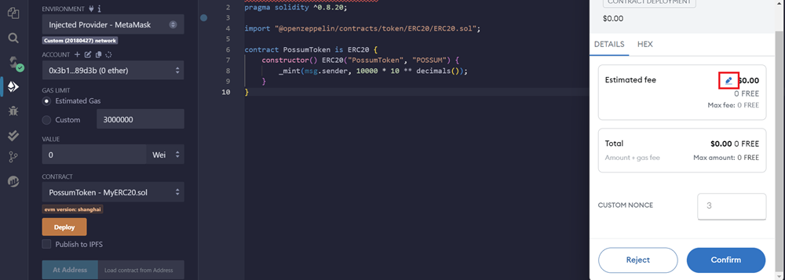
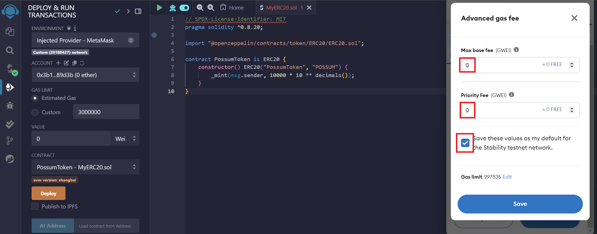

import Tabs from '@theme/Tabs';
import TabItem from '@theme/TabItem';

# Configuring MetaMask for Zero Fees

One of the unique features of Stability is zero-fee transactions. This guide shows you how to configure MetaMask to take advantage of this.

## Understanding Zero Fees on Stability

Stability requires that the `Max Base Fee` and `Max Priority Fee` be set to zero. This is different from traditional Ethereum chains where gas fees are required.

## Configuring MetaMask

### For MetaMask Users

When making your first transaction, you will need to manually set the gas fees to zero. It is recommended to save these values as your default settings.

#### Step 1 - Prepare Your Smart Contract

Before initiating a transaction, navigate to a Web3 IDE of your choice, such as [Remix](https://remix.ethereum.org/). Compile the following example contract:

```solidity
// SPDX-License-Identifier: MIT
// Compatible with OpenZeppelin Contracts ^5.0.0
pragma solidity ^0.8.20;

import "@openzeppelin/contracts/token/ERC20/ERC20.sol";

contract PossumToken is ERC20 {
    constructor() ERC20("PossumToken", "POSSUM") {
        _mint(msg.sender, 10000 * 10 ** decimals());
    }
}
```

_**Note:** Ensure you're using the correct [Solidity and EVM compiler version](../evm_compatibility.md)._

#### Step 2 - Initiate a Transaction

When a MetaMask popup appears to confirm a transaction, click the pencil icon in the estimated fee box.



#### Step 3 - Set Gas Values to Zero

Click the advanced gas fee icon. This will allow you to customize MetaMask for zero gas transactions.



Set your `Max Base Fee` and `Priority Fee` to **zero**.

#### Step 4 - Save as Default

Click the `Save these values as my default...` checkbox to avoid having to manually set the gas in the future.

## For Developers: Coding Zero Fees

When using libraries such as `ethers` or `viem`, you must explicitly set gas fees to zero in your code. 

<Tabs>
  <TabItem value="v6" label="ethers.js v6" default>

```javascript
const tx = {
    ...
    maxFeePerGas: 0n,
    maxPriorityFeePerGas: 0n
};
```

  </TabItem>
  
  <TabItem value="v5" label="ethers.js v5">

```javascript
const tx = {
    ...
    gasPrice: ethers.utils.parseUnits("0", "gwei"),
    maxPriorityFeePerGas: ethers.utils.parseUnits("0", "gwei"),
};
```

  </TabItem>
</Tabs>

A live example of these values being explicitly set to zero is available in the source code of our [Data Store App](https://github.com/stabilityprotocol/datastoredapp).

## Important Notes

- **Always** set gas fees to zero on Stability
- Transactions with non-zero gas fees will revert
- This applies to all networks: GTN and Testnet

## Next Steps

- Review [EVM Compatibility & What's Different](../evm_compatibility.md) to understand other important differences
- Check out [Example Apps](../../../how_stability_works/example_apps.md) for coding examples
- Explore [Tutorials](../../../tutorials/contract_deploy/deploy_contract_with_remix.md) to start building
