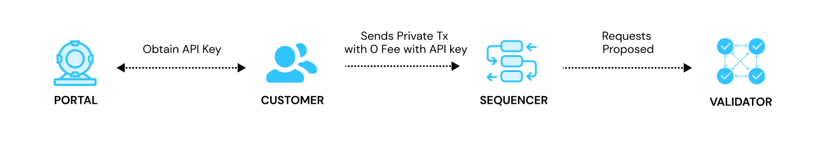

# Architecture

## Overview : Come Get Bored With Us!

Stability Protocol represents a pioneering approach in public blockchains by operating without the need for tokens to facilitate transactions. This is achieved through our innovative validator system. Traditional blockchains rely on consensus mechanisms like Proof of Work (PoW) or Proof of Stake (PoS). In contrast, Stability Protocol introduces a novel consensus mechanism known as Proof of Reputation (PoR). This mechanism involves onboarding trusted entities, which have undergone rigorous Know Your Customer (KYC) procedures, to serve as validators.

## Portal: Private RPCs to Submit Transactions

To submit transactions to Stability, a user must register through our portal. Users begin by obtaining a private RPC through the portal. This RPC is allocated a certain number of credits, effectively determining the number of transactions a user can submit. To submit a transaction, a user consumes credits from their private RPC allotment. 
Using the portal, users can monitor their credit usage and obtain additional credits as needed, allowing for continuous and uninterrupted interaction with the network.

## Sequencing: How Stability Prepares Submitted Transactions

In conventional blockchain systems, transactions are broadcast to a public mempool, where validators and miners select transactions to compile into a new block. Typically, these actors prioritize transactions offering higher fees, as these are more profitable to validate and mine.

Stability Protocol adopts a different approach to transaction sequencing. Our network only considers the chronological order of transaction submissions. This method ensures a fairer and more predictable processing time, as transactions are mined based on their submission time rather than their associated gas fees. As a result, users experience a more consistent and equitable transaction processing environment, with transactions typically being processed within a remarkably short timeframe of 2 seconds.

The network's infrastructure is robust, capable of handling approximately 10,000 transactions per second (TPS). This high throughput is indicative of the network's efficiency and scalability. The underlying architecture and technology enable the Stability Protocol to maintain high performance while offering the potential for further scalability. This scalability is crucial for accommodating an increasing volume of transactions as the network grows, ensuring that the system remains efficient and responsive even under heavy loads.

## Validators: Achieving Consensus

Stability has created a novel consensus mechanism to facilitate our tokenless blockchain.

### Aura: Block Creation
Aura is a slot-based, round-robin mechanism for block creation, performed by a predefined set of validator nodes. In this system, time is divided into distinct slots, and each slot is assigned to a specific validator. This ensures a predictable and fair block creation process, as each validator knows in advance when it will be their turn to create a block. The round-robin nature of Aura ensures that the opportunity to create blocks is evenly distributed among all validators, enhancing the decentralization and fairness of the process.

### GRANDPA: Block Finality 
Grandpa stands for GHOST-based Recursive Ancestor Deriving Prefix Agreement. It is a deterministic finality algorithm that employs the longest chain rule, necessitating a known, weighted set of validator nodes. GRANDPA is designed to work in tandem with a block production mechanism like Aura. It provides finality to blocks, meaning that once a block is deemed final by GRANDPA, it cannot be reverted, ensuring the integrity and continuity of the blockchain. In other words, GRANDPA's determination of the correct block is final. The combination of GRANDPA with a block production mechanism ensures both efficient block creation and robust finality, contributing to the overall security and stability of the blockchain.

Together, Aura and GRANDPA form the backbone of the Stability Protocol's consensus mechanism, ensuring a highly secure and efficient blockchain.

