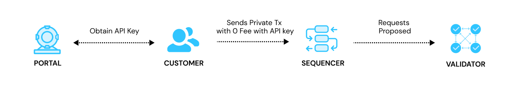

# Architecture

## Overview
Stability deviates from traditional blockchains by removing the token requirement for transaction validation. While traditional networks rely on volatile Proof of Work (PoW) or Proof of Stake (PoS) models, Stability utilizes **Proof of Authority (PoA)**. 

This model leverages a network of known, trusted entities as validators, ensuring a stable environment for production-ready applications.

## Portal: Managed Access via Private RPCs
To interact with the network, developers use the Stability [Account Manager](https://account.stabilityprotocol.com/keys). Instead of managing a wallet with a fluctuating balance, you generate an **API Key** that unlocks a Private RPC.

- **Credit-Based Access**: Your RPC is allocated a set number of credits for transactions.

- **Zero-Gas Execution**: Submitting a transaction simply consumes a credit from your private allotment. No native tokens required.

- **Scalable Management**: Monitor usage and scale your credit limits through the dashboard to ensure uninterrupted service.

For setup details, see the [Stability API](../stability_api/creating_api_key.md) Guide.

## Sequencing: How Stability Prepares Submitted Transactions
Unlike conventional blockchains where "gas wars" allow actors to prioritize more "profitable" transactions offering higher gas fees, Stability ensures a fairer, more equitable environment.

- **Chronological Ordering**: Transactions are processed strictly by their submission time. This consistent and equitable environment ensures predictable transaction processing within approximately 2 seconds.

- **Private Mempool**: Unlike the public mempools of traditional chains, Stability’s mempool is private; transaction details remain hidden until they are finalized on the network.

- **High Throughput**: The infrastructure handles approximately 10,000 transactions per second (TPS), maintaining high performance and potential for further scalability.

## Validators: Achieving Consensus

Stability has created a novel consensus mechanism to facilitate our feeless blockchain.

### Aura: Block Creation
Aura is a slot-based, round-robin mechanism where time is divided into distinct slots, each assigned to a specific validator. This ensures a predictable and fair process, as each validator knows in advance when it is their turn to create a block.

### GRANDPA: Block Finality 
GRANDPA (GHOST-based Recursive Ancestor Deriving Prefix Agreement) provides deterministic finality by employing the longest chain rule. Once a block is deemed final by GRANDPA, it cannot be reverted, ensuring the absolute integrity and continuity of the blockchain. 

Together, Aura and GRANDPA form the backbone of the Stability Protocol's consensus mechanism, ensuring efficient block creation and robust finality, making Stability a highly secure and efficient blockchain.

