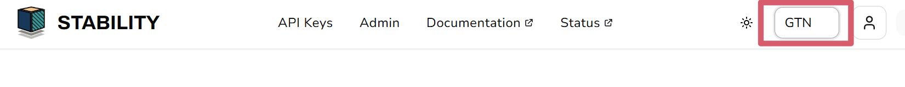
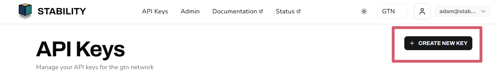
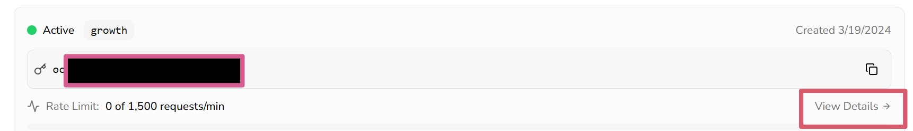

# Creating Your API Key 

This guide will walk you through creating an API key, testing your API Key with your first transaction on the Global Trust Network (GTN) or Stability Testnet.

## RegisterFor An API Key

**Step 1 - Navigate to [Stability Portal](https://portal.stabilityprotocol.com/)**

**Step 2 - Select Your Preferred Registration**

Select your preferred registration method. Stability supports **Google Sign-in** or **Email registration**.

- _Note: If registering via email, ensure you can verify your address._

**Step 3 - Select Your Preferred Network**

Use the dropdown menu in the top-right corner to select your target environment:

- **GTN (Mainnet)**: For production-ready applications.

- **Testnet**: For development and experimental testing.

**Step 4 - Click the `Create New Key` Button**

**Step 5 - Congrats! You've created an API Key**

To view your personal RPC URL click the `View Details` button next to your API key, followed by the `Setup Instructions` button.