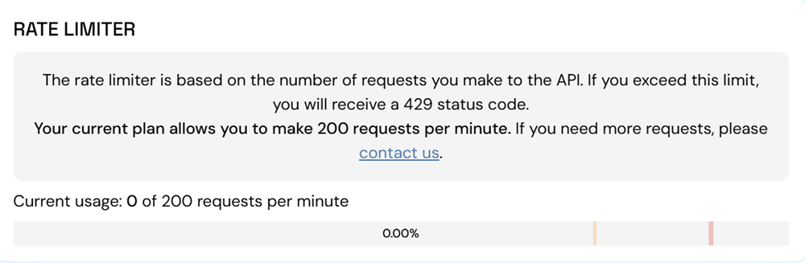

# Rate Limits
Our free tier includes a rate limit of **60 requests per minute**.

- If your application exceeds this threshold, the network will return an `HTTP 429` status code and additional requests within the same rolling minute will be blocked.

- Requests will be unblocked as soon as your rolling average falls back below the 60-request threshold.

## What Counts as a Request?

In the Stability architecture, a "request" is any individual JSON-RPC call made to your private endpoint. It is important to note that a single high-level action in your app may trigger multiple requests. Examples Include:

- Retrieving the latest block number
- Submitting a transaction
- Querying transaction details

You can track your current usage per minute in your [Stability Portal](https://portal.stabilityprotocol.com/). If you anticipate higher throughput, please consider one of our paid tiers with enhanced rate limits.

## How to Increase Limits?

To increase your limits, click the `Manage Subscription` button in the profile tab of [Stability Portal](https://portal.stabilityprotocol.com). Our Pro tier allows for **200 requests per minute**, with higher options available for customized plans.
