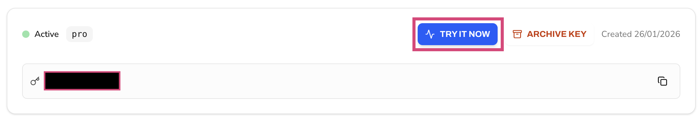
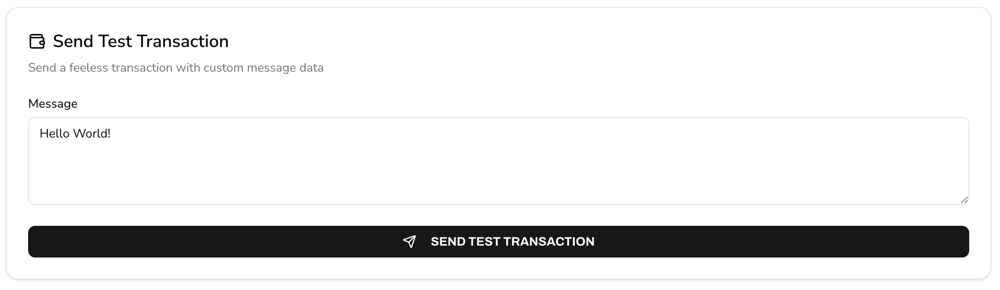

# Testing Your API Key

Now that you have your API key, use the built-in testing tools to verify your connection and execute your first feeless transaction.

## Step 1 - Navigate to `TRY IT NOW`

From your API key list in the portal, click `View Details` and then select the `TRY IT NOW` button.

## Step 2 - Send Test Transaction

The **Send Test Transaction tool** allows you to write a custom message directly to the Stability blockchain using your API Key.

1. Enter a message in the text field (e.g. "Hello World!")
2. Click the `SEND TEST TRANSACTION` button

🎉 **Congratulations!** You have done your first transaction on the network! You're ready to start building on Stability!

## Additional Testing Options

Beyond sending a test transaction, the API testing page provides additional tools to help you interact with the Stability blockchain.

For backend developers, the **Interactive Tester** allows you to send raw JSON-RPC requests directly to the network. You can modify the pre-filled payloads to test specific blockchain methods and view the real-time responses.

