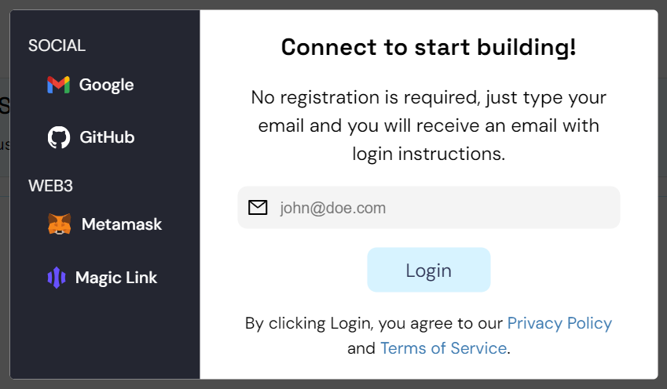

# Getting Started / Connect to Global Trust Network (GTN) or Stability Testnet

This quickstart guide is intended for users who wish to use the Global Trust Network (GTN) through browser-based extensions. In this example, we will use MetaMask, the most popular browser extension for interacting with blockchains.

## MetaMask Configuration

MetaMask allows users to interact with the Global Trust Network blockchain easily. Here's how to set it up:

### 1. Installing MetaMask

If you haven't already, install MetaMask for your browser from the [official MetaMask website](https://metamask.io/).

### 2. Sign Up For An API Key

After installation, you need to add the Global Trust Network to MetaMask. This requires registering for an API Key.

To begin, navigate to Stability's [Account Manager](https://account.stabilityprotocol.com/keys) page and select your preferred method of registration. To receive an API key, you must register using either Github, Google, or Email. If you opt to register via email, ensure you are able to verify your email address.

It's important to note that registrations through Metamask or Magiclink do not provide a dedicated API key.

Once logged in to Stability's [Account Manager](https://account.stabilityprotocol.com/keys), locate the option for generating an API key. Click on the designated button to create your unique API key.

### 3a. Add Network to Metamask + Other Compatible Wallets

    To add your custom RPC to your browser extension wallet, click the Metamask Fox Logo next to your API Key. This will work with Metamask as well as many Browser-extension based wallet. 
    - Note: You may encounter a warning regarding the currency symbol. This is expected, as the Stability network does not use a currency for gas fees. The network can be used without a currency balance.

    If you are not able to add the network to your wallet, you may have to add the network manually. Follow the instructions below.

### 3b. Add Network Manually to a Wallet

    In the event your wallet in not compatible with adding chains via Javascript, you can add the following details to your wallet.
    Replace the 'YOUR_API_KEY' with your own API key.

**For Global Trust Network**

| **Property**           | **Value**                                                 |
|------------------------|-----------------------------------------------------------|
| Network Name           | Global Trust Network                                      |
| New RPC URL            | `https://gtn.stabilityprotocol.com/?api_key=YOUR_API_KEY` |
| Chain ID               | 101010                                                    |
| Currency Symbol        | FREE                                                      |
| Block Explorer URL     | `https://stability.blockscout.com/`                       |

**For Stability Testnet**

| **Property**           | **Value**                                                            |
|------------------------|----------------------------------------------------------------------|
| Network Name           | Stability Test Net                                                   |
| New RPC URL            | `https://free.testnet.stabilityprotocol.com/?api_key=YOUR_API_KEY` |
| Chain ID               | 20180427                                                             |
| Currency Symbol        | FREE                                                                 |
| Block Explorer URL     | `https://stability-testnet.blockscout.com/`   

   - Note: You may encounter a warning regarding the currency symbol. This is expected, as the Stability network does not use a currency for gas fees. The network can be used without a currency balance.

### 4. Complete!

You're now connected to the our blockchain network and ready to make transactions or interact with smart contracts!

