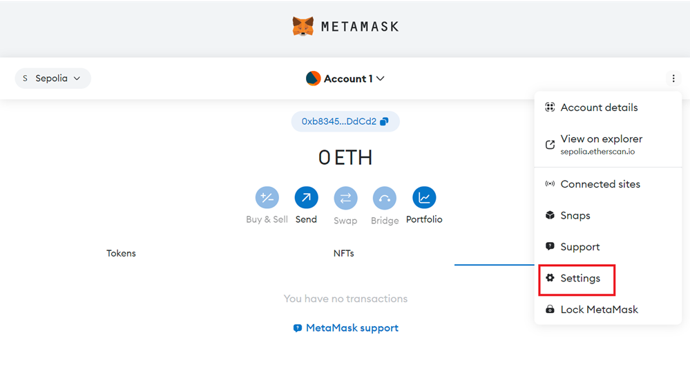
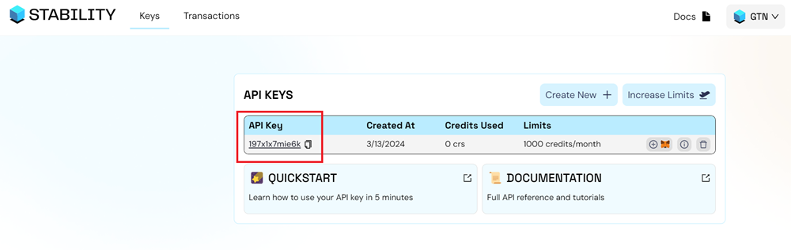
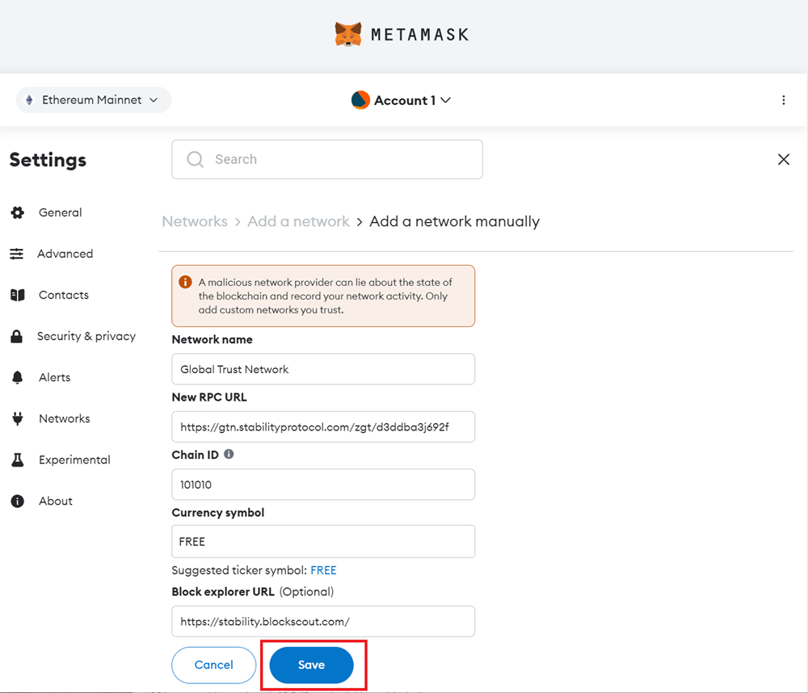

# Getting Started

This quickstart guide is intended for users who wish to use the Global Trust Network (GTN) or Stability Testnet through browser extensions. In this example, we will use MetaMask, the most popular browser extension for interacting with blockchains.

## MetaMask Configuration

MetaMask allows users to interact with the Global Trust Network or Stability Testnet easily. Here's how to set it up:

### 1. Installing MetaMask

If you haven't already, install MetaMask for your browser from the [official MetaMask website](https://metamask.io/download/).

### 2. Sign Up For An API Key

#### Step 1 - Navigate to [Stability Portal](https://portal.stabilityprotocol.com/) and click the `Login | New User' button.

#### Step 2 - Select Your Preferred Registration

On this screen, select your preferred method of registration. For this tutorial, we will be following the Google sign-in path. You may also similarly log in via Email, GitHub, Magiclink, or directly through Metamask.  

It is important to note that registrations through Metamask or Magiclink do not provide a dedicated API Key. Without an API Key, you will not be able to perform transactions on Global Trust Network (GTN) and Stability Testnet. To receive an API Key, you must register using either GitHub, Google, or Email. 

If you opt to register via email, ensure you can verify your email address.

#### Step 3 - Select Your Preferred Network

Using the dropdown menu on the top right, select the network you wish to generate an API Key on.

#### Step 4 - Click the `Create New API Key` Button

#### Step 5 - Congrats! You've created an API Key.

To view your personal RPC URL, click the `Info` button.

Here, you will find your personal RPC URL.

 

### 3a. Add Network Automatically to Metamask + Other Compatible Wallets

To add your custom RPC to your browser extension wallet, which will allow you to use Global Trust Network or Stability Testnet, click the Metamask Fox Logo next to your API Key. This will work with Metamask as well as many other browser extension based wallets. 

If you are not able to add the network to your wallet, you may have to add the network manually. Follow the instructions below.

### 3b. Add Network Manually to Metamask

In the event you are unable to add your wallet automatically via clicking the Metamask Fox Logo above, or you wish to add the network manually, simply follow the steps below.

#### Step 1 - Navigate to `Settings` in Metamask.

#### Step 2 - Click on the `Networks` tab.

#### Step 3 - Click the `Add a network` button.

#### Step 4 - Click the `Add a network manually` text link.

#### Step 5 - Go to the [Stability Account Manager](https://account.stabilityprotocol.com/keys) and copy your API Key.

#### Step 6 - Fill out the network settings using the details below. Be sure to replace the `YOUR_API_KEY` with your own API Key. Afterward, click Save.
    

| **Property**               | **Global Trust Network**                                       | **Stability Testnet**                                               |
|----------------------------|-----------------------------------------------------------------|----------------------------------------------------------------------|
| Network Name               | Global Trust Network                                           | Stability Test Net                                                   |
| New RPC URL                | `https://rpc.stabilityprotocol.com/zgt/YOUR_API_KEY`          | `https://rpc.testnet.stabilityprotocol.com/zgt/YOUR_API_KEY` |
| Chain ID                   | 101010                                                          | 20180427                                                             |
| Currency Symbol            | FREE                                                            | FREE                                                                 |
| Block Explorer URL         | `https://stability.blockscout.com/`                             | `https://stability-testnet.blockscout.com/`                          |

    
### 4. Complete!

You're now connected to our blockchain network and ready to make transactions or interact with smart contracts!

