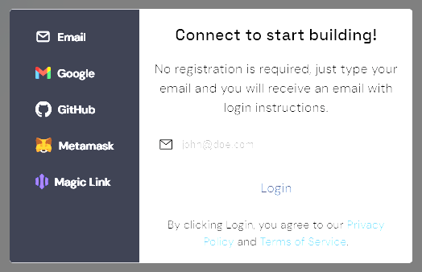
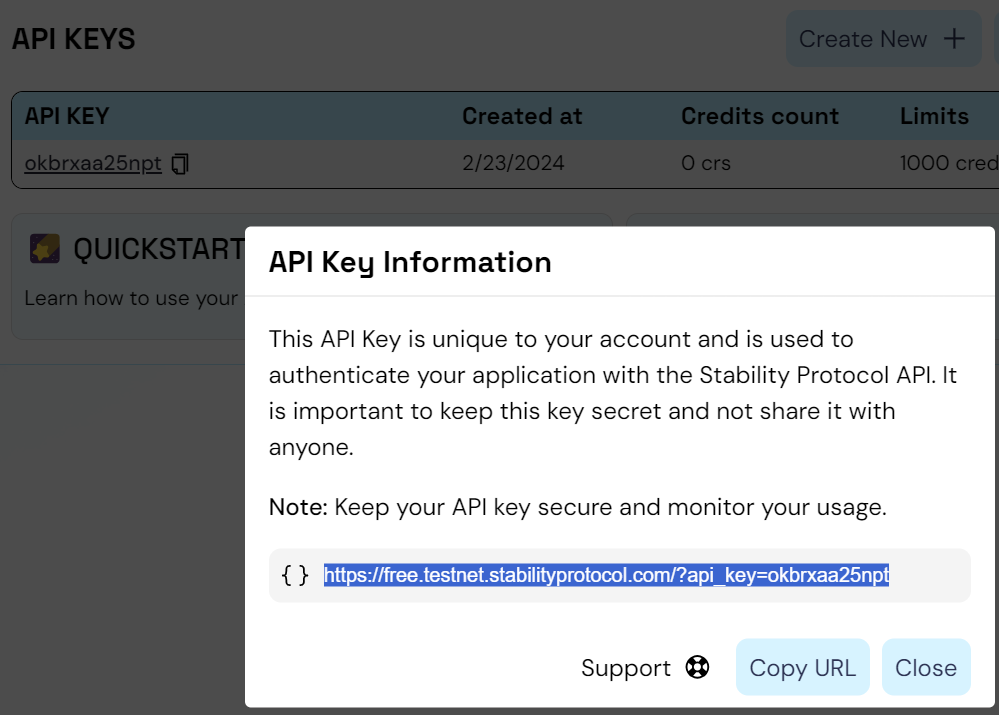

# Getting Started / Connect to Stability

This quickstart guide is intended for users who wish to use the Stability Network through browser-based extensions. In this example, we will use MetaMask, the most popular browser extension for interacting with blockchains.

## MetaMask Configuration

MetaMask allows users to interact with the Stability blockchain easily. Here's how to set it up for Stability Protocol:

### 1. Installing MetaMask

If you haven't already, install MetaMask for your browser from the [official MetaMask website](https://metamask.io/).

### 2. Sign Up For An API Key

After installation, you need to add the Stability Protocol network to MetaMask. This requires registering for an API Key.

To begin, navigate to Stability's [Account Manager](https://account.stabilityprotocol.com/keys) page and select your preferred method of registration. To receive an API key, you must register using either Github, Google, or Email. If you opt to register via email, ensure you are able to verify your email address.

It's important to note that registrations through Metamask or Magiclink do not provide a dedicated API key.

Once logged in to Stability's [Account Manager](https://account.stabilityprotocol.com/keys), locate the option for generating an API key. Click on the designated button to create your unique API key.

Click the info button to reveal your private RPC address. We will be using this to connect to Stability.

### 3. Add Network to Metamask

    Click on the MetaMask extension icon in your browser.

    Inside the MetaMask interface, click on the menu icon (three horizontal lines) and then select `Settings`.

    In the `Settings` menu, find and click on `Networks`.

    Click on `Add Network` to start the process of adding a new network.

    Select the option to `Add A Network Manually`.

    

    Fill in the network details for Stability Test Net as follows. Replace the 'YOUR_API_KEY' with your own API key.

    - **Network Name:** Stability Test Net
    - **New RPC URL:** https://free.testnet.stabilityprotocol.com/?api_key=YOUR_API_KEY
    - **Chain ID:** 20180427
    - **Currency Symbol:** FREE
    - **Block Explorer URL:** `https://stability-testnet.blockscout.com/`

    Note: You may encounter a warning regarding the currency symbol. This is expected, as the Stability network does not use a currency for gas fees. The network can be used without a currency balance.

    After entering all the information, click `Save`. MetaMask will automatically connect to the newly added network.

You're now connected to the Stability Protocol network through MetaMask and ready to make transactions or interact with smart contracts.

