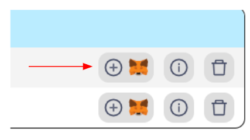

# Getting Started 

This quickstart guide is intended for users who wish to use the Global Trust Network (GTN) through browser-based extensions. In this example, we will use MetaMask, the most popular browser extension for interacting with blockchains.

## MetaMask Configuration

MetaMask allows users to interact with the Global Trust Network blockchain easily. Here's how to set it up:

### 1. Installing MetaMask

If you haven't already, install MetaMask for your browser from the [official MetaMask website](https://metamask.io/download/).

### 2. Sign Up For An API Key

After installation, you need to add the Global Trust Network to MetaMask. This requires registering for an API Key.

To begin, navigate to Stability's [Account Manager](https://account.stabilityprotocol.com/keys) page and select your preferred method of registration. For this tutorial, we will be following the Google sign-in log-path. You may also similarly log in via E-Mail, Github, Magiclink or directly through Metamask.  
It is important to note that registrations through Metamask or Magiclink do not provide a dedicated API key. To receive an API key, you must register using either Github, Google, or Email. 
If you opt to register via email, you ensure you are able to verify your email address.

Once logged in to Stability's [Account Manager](https://account.stabilityprotocol.com/keys), locate the option for generating an API key. Click on the designated button to create your unique API key.

### 3a. Add Network to Metamask + Other Compatible Wallets

    To add your custom RPC to your browser extension wallet, click the Metamask Fox Logo next to your API Key. This will work with Metamask as well as many Browser-extension based wallet. 
    - Note: You may encounter a warning regarding the currency symbol. This is expected, as the Stability network does not use a currency for gas fees. The network can be used without a currency balance.

    If you are not able to add the network to your wallet, you may have to add the network manually. Follow the instructions below.

### 3b. Add Network Manually to Metamask

    In the event your wallet in not compatible with adding chains via Javascript, or you wish to add the network manually, simply follow the steps below.

####     1. Navigate to `Settings` in Metamask.

####     2. Click on the `Networks` tab.

####    3. Click the `Add a network` button.

####     4. Click the `Add a network manually` text link.

####     5. Go to the [Stability Account Manager](https://account.stabilityprotocol.com/keys) and copy your API Key.

####     6. Fill out the network settings using the details below. Be sure to replace the `YOUR_API_KEY` with your own API Key. Afterwards, click Save.
    

| **Property**               | **Global Trust Network**                                       | **Stability Testnet**                                               |
|----------------------------|-----------------------------------------------------------------|----------------------------------------------------------------------|
| Network Name               | Global Trust Network                                           | Stability Test Net                                                   |
| New RPC URL                | `https://gtn.stabilityprotocol.com/?api_key=YOUR_API_KEY`      | `https://free.testnet.stabilityprotocol.com/?api_key=YOUR_API_KEY` |
| Chain ID                   | 101010                                                          | 20180427                                                             |
| Currency Symbol            | FREE                                                            | FREE                                                                 |
| Block Explorer URL         | `https://stability.blockscout.com/`                             | `https://stability-testnet.blockscout.com/`                          |

    
### 4. Complete!

You're now connected to our blockchain network and ready to make transactions or interact with smart contracts!

