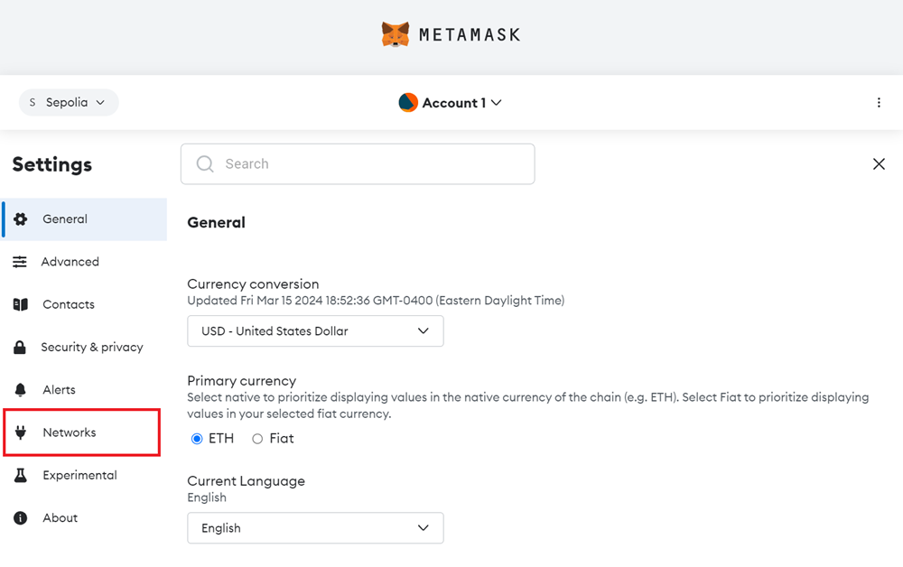
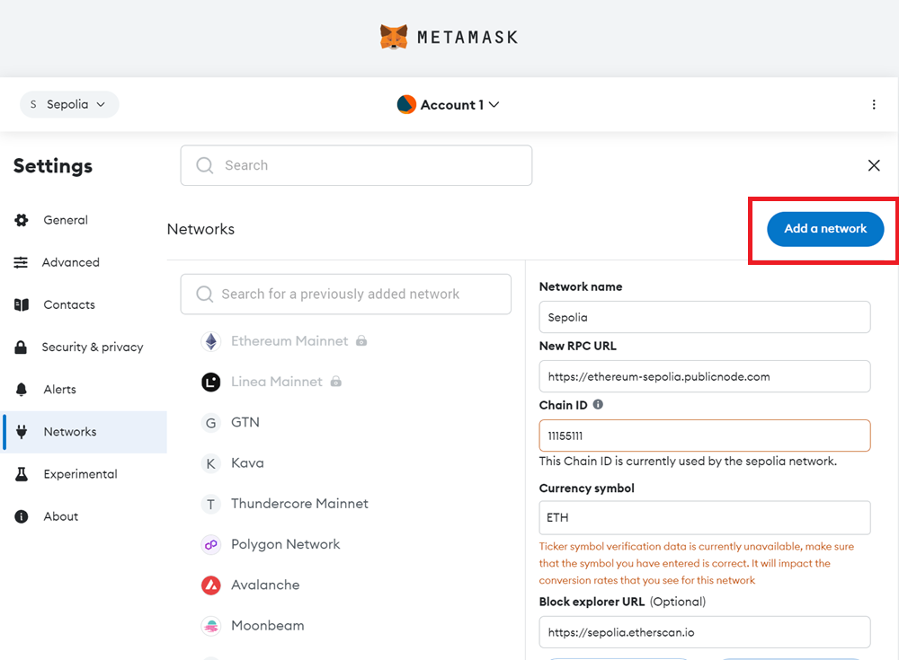
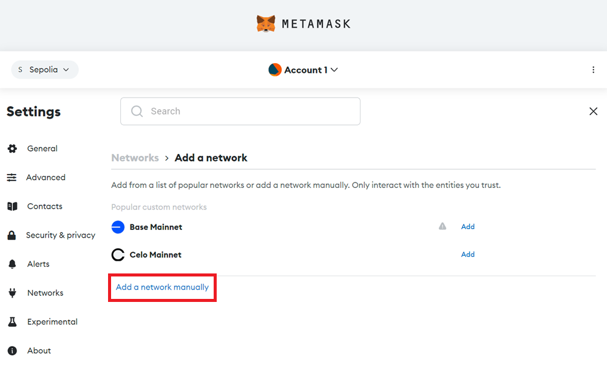
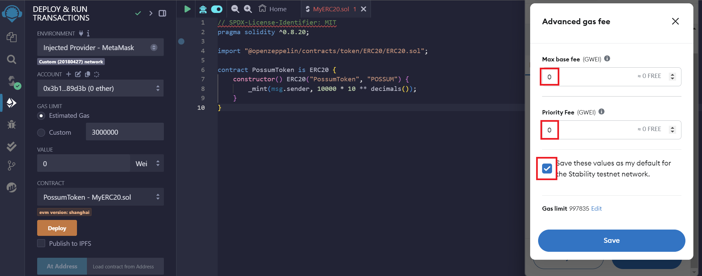

# Getting Started

This quickstart guide is intended for users who wish to use the Global Trust Network (GTN) or Stability Testnet through browser extensions. In this example, we will use MetaMask, the most popular browser extension for interacting with blockchains.

## MetaMask Configuration

MetaMask allows users to interact with the Global Trust Network or Stability Testnet easily. Here's how to set it up:

### 1. Installing MetaMask

If you haven't already, install MetaMask for your browser from the [official MetaMask website](https://metamask.io/download/).

### 2. Sign Up For An API Key

#### Step 1 - Navigate to [Stability Portal](https://portal.stabilityprotocol.com/).

#### Step 2 - Select Your Preferred Registration

On this screen, select your preferred method of registration. For this tutorial, we will be following the Google sign-in path. You may also similarly log in via Email.

If you opt to register via email, ensure you can verify your email address.

#### Step 3 - Select Your Preferred Network

Using the dropdown menu on the top right, select the network you wish to generate an API Key on. Currently, you can choose GTN or Testnet.

#### Step 4 - Click the `Create New Key` Button

#### Step 5 - Congrats! You've created an API Key.

To view your personal RPC URL, click the `View Details` button next to your API key, followed by the `Setup Instructions` button.

Here, you will find your personal RPC URL.

### 3a. Add Network Automatically to Metamask + Other Compatible Wallets

To add your custom RPC to your browser extension wallet, which will allow you to use Global Trust Network or Stability Testnet, click the `Add To Metamask` button while still under the `Setup Instructions` tab. This will work with Metamask as well as many other browser extension based wallets.

If you are not able to add the network to your wallet, you may have to add the network manually. Follow the instructions below.

### 3b. Add Network Manually to Metamask

In the event you are unable to add your wallet automatically via clicking the Metamask Fox Logo above, or you wish to add the network manually, simply follow the steps below.

#### Step 1 - Navigate to `Settings` in Metamask.

#### Step 2 - Click on the `Networks` tab.

#### Step 3 - Click the `Add a network` button.

#### Step 4 - Click the `Add a network manually` text link.

#### Step 5 - Go to the [Stability Account Manager](https://account.stabilityprotocol.com/keys) and copy your API Key.

#### Step 6 - Fill out the network settings using the details below. Be sure to replace the `YOUR_API_KEY` with your own API Key. Afterward, click Save.
    

| **Property**               | **Global Trust Network**                                       | **Stability Testnet**                                               |
|----------------------------|-----------------------------------------------------------------|----------------------------------------------------------------------|
| Network Name               | Global Trust Network                                           | Stability Test Net                                                   |
| New RPC URL                | `https://rpc.stabilityprotocol.com/zgt/YOUR_API_KEY`          | `https://rpc.testnet.stabilityprotocol.com/zgt/YOUR_API_KEY` |
| Chain ID                   | 101010                                                          | 20180427                                                             |
| Currency Symbol            | FREE                                                            | FREE                                                                 |
| Block Explorer URL         | `https://stability.blockscout.com/`                             | `https://explorer.stble.io/testnet/`                          |

### 4. Configure your Metamask for Zero Fees

Transactions submitted to Stability require the max base fee and priority fee to be set to zero. For the your first transaction, you will have to manually set these values to zero. It is advised that you save these values as the default setting for our network.

On your first transaction, A MetaMask popup will appear to confirm the transaction. Click the pencil icon in the estimated fee box.

This will allow you to customize Metamask for zero gas transactions. Click the advanced gas fee icon. Set your `Max Base Fee` and `Priority Fee` to zero. Click the `Save these values as my default...` checkbox to avoid having to manually set the gas in the future. 

### 5. Complete!

You're now connected to our blockchain network and ready to make transactions or interact with smart contracts!

